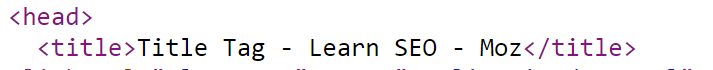
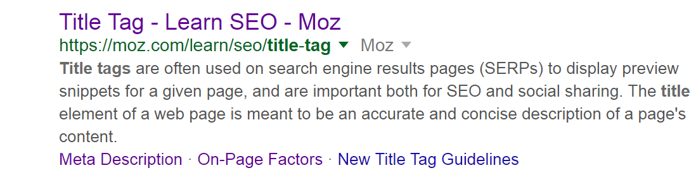
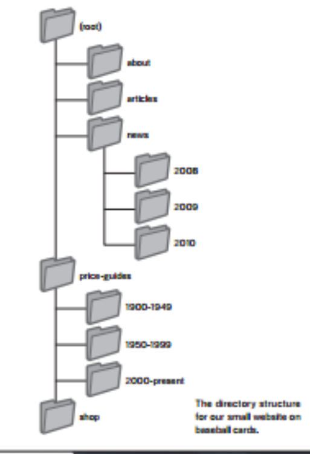
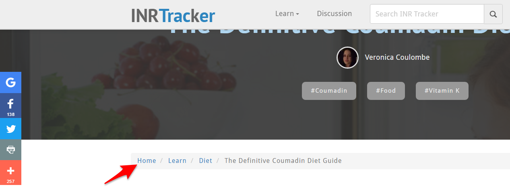
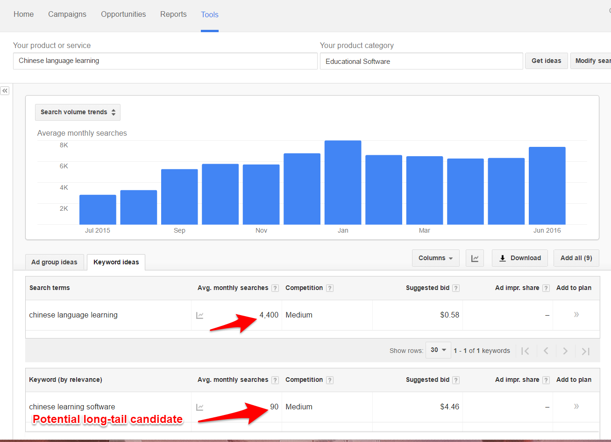
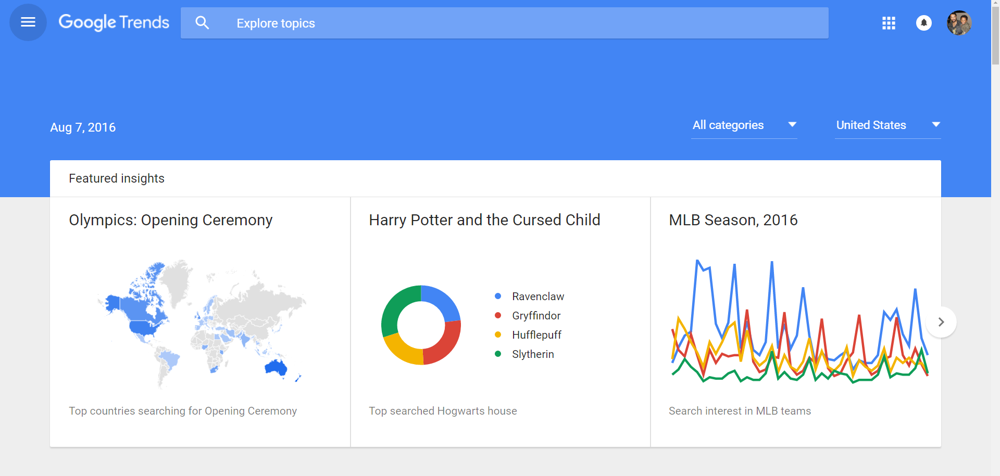
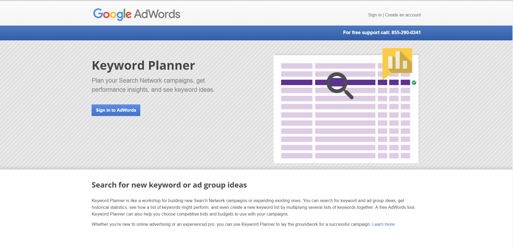
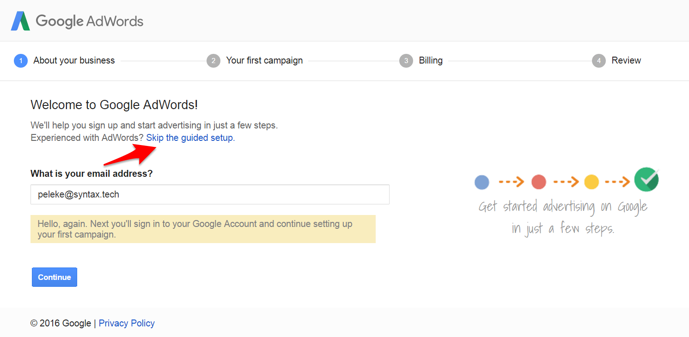
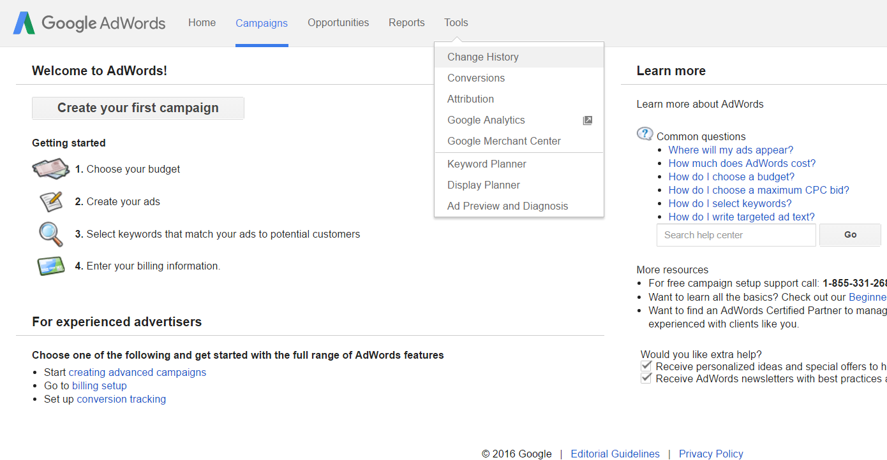

# 17.1 Lesson Plan - Google-Fu

### Overview

Today's lesson will introduce students to the basics of "technical"/conventional search engine optimization (SEO).

#### Instructor Priorities

* Students should be able to enumerate major ranking factors for a website.

* Students should be able to implement major technical SEO techniques. In particular, they should know to:

  * Include a main keyword in the title tag;

  * Include a main keyword in an H1 above the fold;

  * Write meaningful anchor text;

  * Implement simple URLs;

  * Include a main keyword in the URL, where possible.

* Students should be able to explain the importance of optimizing navigation.

#### Instructor Notes

* Projects take priority this week. Feel free to abbreviate the lesson. Consider the exercises optional.

* Have your TAs refer to the [TimeTracker](17.1-TimeTracker.xlsx) to remain on task.

- - -

### Class Objectives

* Students should be able to articulate major search engine ranking factors;

* Students should be able to implement fundamental SEO techniques; and

* Students should be able to articulate the importance of optimized navigational structure.

- - -

### 1. Instructor Do: Introduce SEO & Search Engines (0:15)

* Begin by calling on a student to explain how search engines work.

  * Most likely, the explanation will be that search engines find websites whose content contains the terms of the user's search query.

    * Briefly define the term "keyword" as "a search term that we want Google to associate with our site." We'll talk more about keywords later in the session, but need this basic understanding to get started.

  * Explain that search engines use the textual content of a website to generate search results, along with a number of other.

    * Point out that search algorithms are proprietary. So, aside from what Google, Microsoft, etc., choose to reveal, we don't know _exactly_ what those "other metrics" are.

    * But, thanks to the hard work of SEO researchers, we understand them well enough to get results.

  * Explain that search engines derive rankings by:

    * Visiting a site;

    * Following internal links, to create a "map" of the site's pages;

      * Define an internal link as a link on a website that links to a page on the same website. 

    * "Reading" each page; and

    * Indexing those pages, so their relevance can be checked against user queries.

* Explain that SEO is about making it easier for search engines to take each of these steps.

* Explain that we'll focus on two broad components of SEO:

  * The **technical component**. This consists of optimizing a site's structure so as to be easily crawled and indexed by search engines. The techniques used for this are often known as **technical** or **conventional SEO**.

  * The **content marketing component**. This consists of a business's editorial plan—what kinds of content it will publish, when it will publish it, on what channels, etc.

* Broadly speaking:

  * Technical SEO guarantees that a site can be accurately crawled and indexed by search engines; and 

  * Valuable content gives visitors a reason to engage with the site, which increases its popularity; and, in turn, its search rankings.

* Emphasize that a successful SEO strategy must coordinate these two efforts.

* Explain each of the following points, and how they relate to SEO. These points are also available as a [PDF that you can slack out to students](Resources/SEO_Fundamentals_Review_Guide.pdf).

  * **Title tags**. The contents of a page's title tag are what appear in the browser's tab as the "name" of the current page.

    * Every page on your site should have a **unique** title that accurately describe its page.

    * In general, keep titles to 65 - 75 characters long. Most search engines don't display more than this in search results.

      * If you're targeting particularly long keywords, or include branding text in your title tags, it's okay to go longer. 

    * Make sure your page's keyword(s) appear as early in the title as possible.

      * E.g., **JavaScript Error Handling in a Nutshell** might be a good choice for an article on...Well, JavaScript Error Handling.

_The contents of a web page's title tag._

_Google uses the contents of the title tag to populate its search results._

* **Optimize URLs**. Your site's URL structure has a major impact on its search engine rankings.

  * When possible, include keywords in your URL. You might serve an article about Bananas Foster at `http://peleke.me/blog/bananas-foster-recipe`, for instance.

  * Make sure URLs and page titles are as similar as possible. For instance, a page with the title '10 NPM Packages You'll Love' might be served at `.../blog/10-npm-packages-youll-love`.

  * Prefer simple URLs. `https://en.wiktionary.org/wiki/skullduggery` is preferable to `https://www.google.com/webhp?sourceid=chrome-instant&ion=1&espv=2&ie=UTF-8#q=query%20strings%20in%20url`. 

    * This is more important for users and social shares than for search engines, but remains important, nonetheless.

* **Optimize navigation structure**. Search engines can't crawl a site that doesn't have well-designed navigation. This means that a site's navigation structure is one of the most important factors in determining its search engine rankings.  

  * Make sure your site contains at least one link to every page. This ensures search engines can in fact crawl and index your entire site.

  * Create a natural, hierarchical navigation structure.

  * Feel free to discuss and slack out this beginner's guide to [information architecture](http://www.uxbooth.com/articles/complete-beginners-guide-to-information-architecture/).

_Google's SEO guide gives a good example of what a hierarchical structure should look like._

* Make sure your navigation is mostly textual.

  * In other words, use anchor _text_, rather than images, etc., to implement navigation. 

  * Emphasize that this is important for ensuring search engines crawl your site correctly

* Include breadcrumbs on larger sites.

_INRTracker has highly effective breadcrumb navigation._

* **Include sitemaps**. A sitemap is effectively a set of links to all the major destinations on your website.

  * Sitemaps "help search engines find and classify content on your site that they may not have found on their own" ([SEO Moz](https://moz.com/beginners-guide-to-seo/search-engine-tools-and-services)), including video, images, etc., which are traditionally very difficult for machine to understand and index.

  * Tools like [XML-Sitemaps](https://www.xml-sitemaps.com/) can generate sitemaps for you.

    * There are also packages, such as NPM's [sitemap](https://www.npmjs.com/package/sitemap), that you can use to programatically generate sitemaps for dynamic sites.

* **Meta tags**. There are several different [meta tags](https://developer.mozilla.org/en-US/docs/Web/HTML/Element/meta), but one stands out for our purposes.

  * **Description**. 

    * The description tag looks like: `<meta name="description" content="...">`, where your textual description of the page is the value of the tag's `content` attribute.

    * Search engines often use the `content` of a meta description to provide an excerpt of a page's contents. The description tag [doesn't directly affect rankings anymore](https://webmasters.googleblog.com/2009/09/google-does-not-use-keywords-meta-tag.html), but, as with well-written titles, compelling descriptions do garner click-throughs.

    * Note that they don't _always_ use the meta description this way. Sometimes, they'll ignore it in favor of what they deem the most relevant text on the page, relative to the user's search.

      * Keep your descriptions under 160 characters. Search engines might truncate anything longer.

      * Search engines will create their own snippets if you don't provide a description. These snippets will always contain the keywords a user searched for. That means that, if your page targets multiple keywords, or features content about several different topics, it's okay not to write a description tag. In these cases, the search engines do a good job on their own.

* Students might be overwhelmed by all of this information. Reassure them that there are tools and checklists already in place to help them remember and implement these measures. 

  * Slack out this [Technical SEO Checklist](https://moz.com/blog/technical-site-audit-for-2015), and direct students to the sections titled **On-page optimization** and **Content**.

  * Slack out [the review guide](Resources/SEO_Fundamentals_Review_Guide.pdf) for student reference.

### 2. Partners Do: Review On-Page Factors (Optional) (0:15)

* Slack out the following instructions to students.

  * **Instructions**:

    * Choose a content-heavy website to evaluate, such as a blog, magazine, or news site. CNN and Thomson Reuters are good choices.

    * Browse the site for a few minutes to get a feel for how it's structured.

    * With your partner, select a page to evaluate. Refer to the On-Page Optimization and Content sections of the Technical SEO Checklist, and see how it measures up.

    * Keep track of your results. Be ready to share your findings with the rest of the class.

### 3. Everyone Do: Discuss Activity (Optional) (0:10)

* Check [1-On-Page-Factors/Solutions](Activities/1-On-Page-Factors/Solutions/README.md) for an example solution.

* Call on different groups to discuss the following:

  * The site(s) they chose to evaluate;

  * How well the site "measures up", according to the checklist; and

* Stress that technical SEO is a substantial topic, and that this is only an introduction. Encourage them to regularly refer to resources such as the [Checklist](https://moz.com/blog/technical-site-audit-for-2015); [SEO Moz](https://moz.com/); [Backlinko](http://backlinko.com/); and others whenever they work on sits that demand SEO.

* Spend some time answering student questions.

- - -

### 4. BREAK (0:10)

- - -

### 5. Instructor Do: Keywords (0:15)

* Explain that keywords are terms that you want search engines to associate with your website.

  * For example, if you own a website about JavaScript frameworks, you might want Google to present your site to users who search for "Angular 2".

  * Attempting to get a search engine to report your site to users who search for a given keyword is called **targeting** that keyword.

* Explain that keywords fall into one of two buckets.

  * **Head terms**. These are highly generic search terms that account for a large number of searches, such as blogging; language; or programming.

  * **Long-tail terms**. These are highly specific search terms, which account for much less search volume than head terms. Phrases like "using traits in Scala"; "best earth tone blazers by Armani"; or "reactive programming with RxClojure" are examples of long-tail terms.

* Explain that ranking for head terms is difficult, because they're so popular. Conversely, ranking for long-tail terms is relatively easier, because they're not.

  * Explain that targeting long-tail keywords is crucial. It helps drive people with specific needs directly to content that address that specific need.

  * Emphasize that a strong SEO strategy will target a mixture of head terms and long-tail keywords.

* Determining which keywords are most profitable is an iterative process. Crudely, its steps can be distilled into the following:

  * **Determining Head Terms**. In general, what topics do you want your site to rank for? Make a list of relevant head terms.

    * If you sell a language-learning app, your head terms might include "language"; "language acquisition"; and "language learning".

  * **Determining Long-Tail Keyword Candidates**. What specific phrases are your target users searching for that are relevant to your content?

    * If your language-learning app helps users learn Chinese characters, one such specific phrase might be "how to memorize Chinese characters".

    * These aren't your final keywords—just starting points for more quantitative research.

  * **Research Related Searches**. Try running a google search for some of your long-tail and head term candidates. Look at the suggested "related searches". These are an indispensable resource for understanding what users actually search for.

  * **Formal Keyword Research**. Use a tool like [Google's Keyword Planner](https://adwords.google.com/KeywordPlanner) to get quantitative information on keywords related to the terms you've brainstormed.

    * Keyword Planner will give you statistics on how many times users search for a given keyword; suggest related keywords; and predict the cost of a paid campaign targeting a given keyword, amongst other things.

    * When deciding on keywords, consider:

      * **User Expectations**. What content does someone using this search term expect to see on a page that comes up for it? In other words, how do you write content that would satisfy visitors?

      * **Search Volume**. How popular is the keyword, in terms of number of searches per month? What percentage of that do you expect to get? How many visitors does that work out to? 

      * **Keyword Difficulty**. How popular is they keyword? Do you have a lot of competitors who already rank for it? [Ahrefs has good reading on this concept](https://ahrefs.com/blog/keyword-difficulty/).

_Google's keyword planner provides a wealth of data on different search terms._

* [Google Trends](https://www.google.com/trends/) is another indispensable tool for identifying search targets.

_Google Trends provides up-to-date information on trending topics._

* **Execute**. Plan and execute a content strategy around the keywords you've selected.

  * In other words, plan to publish material written against your keyword strategy.

* Point out that sites already running a tool such as Google Analytics will be able to see what searches are bringing users to the site. When possible, use this information to identify keywords to optimize around.

* Finally, explain that it's important to make sure that the keywords you choose appear neither too often or too seldom on a page. 

  * Keyword density isn't as important a factor in SEO as it used to be. But there are certain places keywords should definitely appear.

  * Slack out the following guidelines for optimal keyword density. Most of these appear on [SEO Moz](https://moz.com/beginners-guide-to-seo/basics-of-search-engine-friendly-design-and-development), if students are interested in further reading.

    * Keywords should appear in the title tag once;

    * Once in an H1 near the top of the page;

    * Once in the URL;

    * Once in the meta description; 

    * At least once in an image `alt` attribute; and

    * 2-3 times in page content, with variations (pluralizations, long-tail phrases, etc.). Distribute keywords evenly throughout your text.

    * Use descriptive anchor text. Don't use links that read "_click here_ for more about SEO techniques"; prefer links like, "Learn more about _SEO techniques_."

### 6. Partners Do: Keyword Research (Optional) (0:15)

* This activity will require access to Google's Keyword Planner. Walk students through the following steps.

  * You can only get access to Keyword Planner without a credit card if you click the link that reads: "Skip guided setup." **Make sure students follow along exactly**, or they'll have to redo the entire process with a different email address.

* Tell students to go to the [homepage or Google's Keyword Planner](https://adwords.google.com/KeywordPlanner).

  * Tell them to click the **Create a Account** button in the top right.

_The Keyword Planner homepage._

* On the account creation page, direct students to click the link that reads, "Skip the guided setup". **This is crucial**.

_Make sure students click 'Skip the guided setup.._

* Tell them to fill out and submit the form on the next page.

* They'll be prompted to sign into their Gmail accounts. Tell them to do so.

* This should reveal the Keywords Planner dashboard. Have them navigate to the **Keyword Planner**, under the **Tools** tab.

_The Keyword Planner dashboard._

* Slack out the following instructions to students:

  * **Instructions**:

    * You and your partner are starting a blog. Choose a general topic for it—e.g., soccer; wine; chocolate; etc.

    * Make a list of 3-6 head terms for your topic.

    * Make a list of 3-6 long-tail candidates for your topic. 

    * Use these lists in conjunction with the keyword planner's "Search for new keywords" feature. Create a list of keywords to target. Be prepared to explain and defend your choices for the class.

    * BONUS. If you have time, use your keywords to create headlines for 2-4 articles for the month. Write down the page title, article headline, and target keyword(s) for each article.

### 7. Everyone Do: Discuss Activity (Optional) (0:10)

* Call on a couple of groups, and have them answer the following questions.

  * What topic did you choose for your blog?

  * What head terms did you choose for your topic? What long-tail candidates? How did you decide on these?

  * What keywords did Keyword Planner suggest?

    * Were you able to identify a healthy mixture of head and long-tail terms?

    * Were you able to draft a content strategy around these keywords?

    * How difficult do you expect it will be to rank for your chosen keywords?

* Check that students used similar page titles and headlines, and that each uses a version of one of the article's target keywords.

* Check [2-Keyword-Planner/Solutions](Activities/2-Keyword-Planner/Solutions/README.md) for an example solution.

- - -

### Copyright

Coding Boot Camp © 2016. All Rights Reserved.
