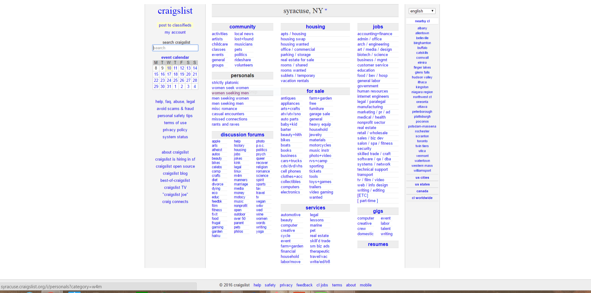
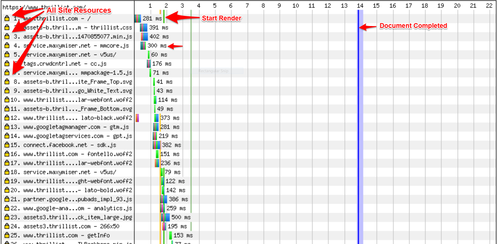

# 17.3 Lesson Plan - Web Performance

### Overview

This lesson will introduce students to the basics of web performance, as well as Google Analytics and Webmaster Tools.

#### Instructor Priorities

* Students should be able to identify, and explain the significance of, the major features of a waterfall chart. Namely:

  * The meaning of the major "colored bars":

    * Dark Green = DNS Lookup

    * Orange = TCP Connection

    * Bright Green = Time to First Byte (TTFB)

    * Blue = Content Download

  * The vertical bar indicating Start Render; and

  * The vertical bar indicating Document Complete.

* Students should be able to identify potential bottlenecks in a site's performance, justifying their hypotheses with data from a waterfall chart.

* Students should know to implement fundamental best-practices of web performance, namely:

  * gzipping resources;

  * Minifying and concatenating CSS/JS;

  * Caching static resources; and

  * Loading stylesheets in `head` and `script`s in the end of `body`.

#### Instructor Notes

* Projects take priority this week. Feel free to abbreviate the day's lesson plan if necessary.

* Have your TAs refer to the [TimeTracker](17.3-TimeTracker.xlsx) to remain on track.

- - -

### Class Objectives

* Students should be able to interpret waterfall charts;

* Students should be able to identify potential performance improvements for a site; and

* Students should know their way around Google Analytics and Webmaster Tools.

- - -

### 1. Instructor Do: Introduce Web Performance (0:10)

* Point out that it is ultimately UX, not features, that attracts long-term users.

  * A groundbreaking site that has no mobile version will fail if 95% of its target audience prefer to surf the web from their mobile devices.

    * "If content is king, UX is kingdom."



_Craigslist is a classic example of a site with lackluster graphics, but highly optimized UX._

* Explain that how quickly your site loads is one of the most important aspects of its UX.

  * The following statistics come courtesy of [Kissmetrics](https://blog.kissmetrics.com/loading-time/).

    * "47% of consumers expect a web page to load in **2 seconds or less**."

    * "A **1 second delay** in page response can result in a **7% reduction** in conversions."

    * Amazon calculated that an extra second in page load times could cost $1.6 billion ([Fast Company](http://www.fastcompany.com/1825005/how-one-second-could-cost-amazon-16-billion-sales)).

* Explain that the term **web performance**, or **web perf**, refers to page load speeds.

* Take a moment to get students thinking. Ask questions like:

  * What factors do you think contributes to page load speeds?

  * Is backend or frontend optimization more important for performance?

  * Think of a slow-loading website you've visited. Why do you think it was so slow?

* Explain that the reason we have to wait for sites to load is because we have to wait for a server to send us the files we need to view the site.

  * Waiting for these resources can be slow, if they are large, or if there are many of them.

  * [It turns out that 80-90% of the time users spend waiting for sites to load is due to **frontend resources**](https://www.stevesouders.com/blog/2012/02/10/the-performance-golden-rule/), _not_ backend processing.

### 2. Instructor Do: Client-Server Architecture (0:10)

* Remind students of the basic structure of client-server architecture.

  * A **client**—our web browser— _requests_ information.

  * A **server**—the computer on which a website's files are hosted— _responds_ with information.

* Remind students that, when you visit a URL, the browser sends an HTTP request to a server, and the server responds.

* Explain that there are several steps involved in this process. Four in particular are relevant to web perf:

  * **DNS Lookup**. Explain that DNS stands for Domain Name System.

    * Explain that browsers must translate human-readable URLs to numerical IP addresses before they can make a request.

    * This process of looking up an IP address given the domain name is known as (forward) DNS lookup.

  * **TCP Connection**. Explain that TCP stands for Transmission Control Protocol.

    * Explain that this is the process by which a browser and server acknowledge that they're connected and ready to transmit data to one another.

* **SSL Negotiation**.

  * Explain that some sites encrypt traffic for privacy with a technology called SSL.

  * Explain that SSL negotiation is the process by which the client and server establish that encryption.

* **Time to First Byte**, or TTFB.

  * Explain that this is the amount of time it takes a server to begin sending a resource to the browser after a connection has been established.

  * In other words, this is the time between when a browser establishes a connection and begins to download resources.

* **Content Download**. This is the process of _finishing_ a download once it's started. 

  * **Wait until after questions to share this**, but do remember to mention that the time it takes a browser to _finish_ downloading a resource is a frequent source of bottlenecks.

* Take a moment to engage the class. Ask questions like:

  * Which of these would you guess we can improve the most? The most easily?

    * Content download.

  * Do you think backend logic influences any of these? Frontend?

    * Backend logic influences TTFB. Frontend _resources_ influence content download times.

  * How can you speed up content downloads?

    * Good answers: Compress files; CSS sprites; caching; etc.

* Take a moment to answer student questions if any arise.

### 3. Instructor Do: Waterfall Charts (0:15)

* Explain that we can create a **waterfall** chart to measure exactly how long each of the above four steps takes for each resource on our website.

* Open up [1-Waterfall-Charts/Examples/waterfall.png](Activities/1-Waterfall-Charts/Examples/waterfall.png).



_A standard-issue waterfall chart._

* Explain the following:

  * Explain that waterfall charts have resources on the y-axis, and time on the x-axis.

    * Point to a bar, and tell students to ignore the colors, for now. 

    * Explain that the width of the bar shows how long it takes the corresponding resource to load.

  * Point out that each bar is multi-colored, and contains "subsidiary bars".

    * **DNS lookup** is the **dark green** sub-bar.

    * **TCP connection** is the **orange** sub-bar.

    * **TTFB** is the **green** sub-bar.

    * **SSL Negotiation** is the purple sub-bar.

    * **Content download** is the **blue** sub-bar. 

      * Emphasize that this is where we'll focus most of our time as developers.

  * Point out that not all resources involve a TCP connection.

    * Explain that this is because a browser and a server can reuse old connections, rather than create new ones on each request.

  * Finally, draw attention to the three indicated vertical lines.

    * **Start Render** is the time at which content begins to load in the user's browser—that is, the time at which users can perceive that the site is loading.

    * **Document Complete** is the time at which all static page content is loaded. This is also the time at which browsers fire the `onload` event.

    * **Fully Loaded** is the time at which the connection has been idle for two seconds. 

### 4. Partners Do: Profile Websites (0:20)

* Slack out the following instructions to students.

* **Instructions**:

  * In this activity, you'll learn how to generate waterfall charts for a website, and get practice reading them.

  * Go to Web Page Test's website:  <https://www.webpagetest.org/>

  * You'll see a form prompting you for a URL, test location, and browser. Where your servers are located, and what browser you use influence page load times. For our purposes, it's fine to use the defaults.

  * Enter a site in the URL prompt—any will do—and submit the test. `http://thrillist.com` is a good choice if you're not sure of what to try.

  * You'll have to wait a bit to get your test results. Be patient.

  * When you get your test results, you'll be presented with two rows of numerical data, and waterfall charts below it.

  * Look at the row of data called **First View**. Discuss what the contents of each cell mean with your partner. You are encouraged to read about Speed Index, but free to skip this column if you wish.

  * Look at the row of data called **Repeat View**. Are any numbers different? If so, which?

  * Turn your attention to the table below this data. Look a the column called Waterfall, and click on the first thumbnail.

  * With your partner, answer the following:

    * About how long did it take the server to begin sending back the first resource?

    * At about what time did the server finish sending the last resource?

    * At about what time did Start Render occur? Document Complete?

    * How many resources did your site request?

    * Look at the waterfall chart for the repeat view. Is anything different? How many resources were requested?

    * Judging by the "sub-bars", which portion of the request/response cycle seems to take longest?

    * At the far right of the table containing the waterfall charts are screenshots of the page. Why might these be useful?

### 5. Instructor Do: Review Activity (0:10)

* Open up [1-Waterfall-Charts/Solutions/solutions.md](Activities/1-Waterfall-Charts/Solutions/solutions.md). These solutions are with reference to [test results for Thrillist](https://www.webpagetest.org/result/160810_5V_1XDV/).

* Ask different groups to share their answers for the exercise. 

  * Ask different groups to answer different questions—i.e., ask one group to share how many resources their site requested, another to share their Start Render time, etc.

* Draw attention to the fact that there is both a First view and a Repeat view.

* Explain the difference.

  * **First view** displays the results of visiting the page with an empty browser cache.

    * _"Imagine you just opened your new Macbook, and visited Thrillist. First view is what the request profile would look like in that case."_

  * **Repeat view** displays the results of visiting the page _after_ having 

    * _"Imagine you visit Thrillist; accidentally close the tab; and load it up again. Repeat view is what the request profile would look like in that case."_

* Explain that one way to increase site load speeds is to tell browsers to save resources that don't change much. Sites that do this properly will have faster speeds for their repeat view than for their first view.

  * Reassure students that we'll come back to this in detail after the break.

* Take a moment to answer any student questions that arise. If none do, begin the break early.

- - -

### 6. BREAK (0:10)

- - -

### 7. Instructor Do: Performance Guidelines (0:15)

* Explain that waterfall charts allow us to check if our site is loading fast enough.

  * What constitutes "fast enough" depends on the site. 

  * Absolute figures don't mean much, given the potentially vast differences between websites.

  * That said, there are a few guidelines to keep in mind:

    * TTFB around 0.2s is acceptable.

    * Start Render should occur as early as possible—in the neighborhood of 2s is acceptable.

      * Anything longer than 4s is disastrous for bounce rates. 

    * Document Complete should occur as early as possible, though there's no meaningful absolute benchmark for this one. 

* In addition to telling us how our site performs right now, waterfall charts reveal performance bottlenecks.

* We'll talk about performance goals on a "bar-by-bar" basis. 

* Reassure students that we'll focus our perf efforts in just a few places.

  * **DNS Lookup**. There's not much you can do about the green bars.

  * **TCP Connection**. There's not much you can do to establish connections faster. _But_, you can save time by reducing the number of times you need to establish a connection.

    * You can use keep-alives, also known as persistent connections, to use a single connection to handle multiple requests.

    * Different servers implement this differently.

    * You mostly don't need to worry about this in Node/Express.

      * "The HTTP Agent also defaults client requests to using Connection:keep-alive."

  * **SSL Handshake**. There's not much you can do to speed this up.

  * **Time to First Byte**. Excessively long TTFB can be due to a couple of things.

    * **Your server is too far away from your client**. If your server is in New York City, but your customer is in Shanghai, your site might be slow for them by simple virtue of the fact that you're far away.

      * In this case, consider using a **C**ontent **D**elivery **N**etwork.

      * Explain that this allows you to host files in several places, and serve clients from whichever "mirror" is closest to them.

    * **Your backend logic is slow**. You'll have slow TTFB if your server takes a long time to decide what to send in its response.

      * If you suspect this is an issue, identify your problem routes/middleware; benchmark their logic; and see if it actually is slow.

      * Slow database queries are a common culprit here.

  * **Content Downloads**. Content downloads take a long time, and it's here that we'll spend most of our performance efforts. Touch on the following guidelines for maximizing content download speeds.

    * **Eliminate empty** `src` **and** `href`. When a browser sees markup like: `` or `<a href="">`, it fires a useless request to your server. 

    * **Load stylesheets in** `head` **and keep** `script` **tags in** `body`. Linking to stylesheets in the `head` of your document makes your page start to render faster. Loading scripts in the bottom of `body` ensures the browser loads resources as fast as possible.

      * Explain that `script` downloads are blocking. Hence, it's best for UX to wait until the rest of the page is loaded and visible before loading scripts.

    * **Minify and Concatenate JS and CSS**. 

      * Minifying your JavaScript and CSS ensures the browser downloads smaller files. 

      * Concatenating JS and CSS ensures the browser makes fewer requests.

    * **gzip Everything**. [gzip](https://howtonode.org/cloudboost-cache) compresses files before sending them to the browser. Compression rates can approach 90%, so **this one is extremely important**.

    * **Cache Static Files**. When you visit CNN's website, you expect some content to change—the article, for instance—and some to stay the same—like the branding.

      * Servers can tell browsers to save, or **cache**, resources that aren't going to change often.

      * This means that visitors won't have to make as many HTTP requests next time they visit, because they'll already have certain necessary assets on their computers.


```
* **Use a CDN**. Using a CDN ensures users aren't penalized for being far away from you.
```

* There are additional guidelines, but these are a good start.

* Slack out the [YSlow Performance rules](http://yslow.org/).

* Encourage students to keep these on-hand when building sites, and to implement the recommendations whenever possible.

* Finally, encourage them to download the YSlow plugin for their browsers. This will allow them to analyze how well a given site implements various performance guidelines.


_Install the YSlow plugin!_

### 8. Partners Do: Performance Tweaks (Optional) (0:20)

* Students will spend the rest of class working on projects. 

* To maintain some continuity while shifting gears, students will review their projects from the standpoint of performance.

* Slack out the following instructions.

  * **Instructions**:

    * For this activity, you'll make some performance tweaks to your project.

    * Start by cross-checking your project against the YSlow guidelines. Is there anything you're not doing that you should be? Do you have empty src tags anywhere? If you don't understand a rule, feel free to skip it, or ask a TA if it applies to your site.

    * Next, run YSlow on a local deployment. What does it report? Is there anything you can fix?

    * If you use Chrome, you can use its Developer Tools instead of YSlow. Open the console; click the Audits tab; and click the Run Audit button to test your site. 

    * BONUS. Use both YSlow and Developer Tools. Do they agree in their suggestions?

    * Be ready to discuss any improvements you've made.

### 9. Everyone Do: Discuss Activity (Optional) (0:10)

* This is meant to be an open-ended discussion.  Feel free to play it by ear, or skip it entirely, if students are "in the zone" with their work.

  * If you choose to skip the discussion, remember to remind students that the activity is done, and that they can work on their projects freely.

  * Otherwise, call on a few groups to share their improvements.

### END

- - -

### Copyright

The Coding Boot Camp © 2016. All Rights Reserved.
