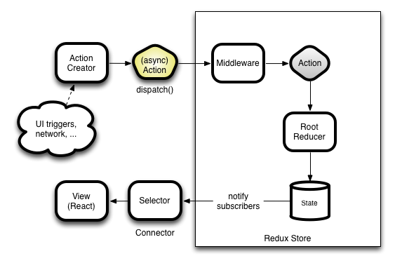

# Day 2 Lesson Plan - The Ropes of Redux.
( interesting aside, the origin of the term "Learn the ropes" comes the nautical world where new sailor recruits learned to tie knots and handle the ropes for the sails that propelled the ship! Often learning on the job under the supervision of experienced sailors. )

### Overview

Todays lesson comprises of a short introduction explaining the theory and concept behind Redux, with the majority of the class time dedicated to walking students through building the example application in class. The main class activity is a difficult one, and students should form groups to tackle it.

Redux has particularly good documentation. Throughout this class we'll be making efforts to utilize the existing documentation whenever possible. It's important to get students into the habit of checking documentation for the answers they need.

#### Intructor Priorities

Students should be able to:

* Re-create the in class simple app example using Redux.

* Understand what Reducers, Actions, and Action Creators are. As well as understand where in the data cycle they fit.

* Understand when to use Redux and when Redux is overkill for your application.

#### Instructor Notes

* **Important** a notes.txt file is included for your convenience. This notes file corelates directly to the first two examples you'll be walking the students through.

* Redux is a complex topic that the students should not be expected to master in a day. Your goal here is to introduce the concept, use cases for Redux, and a very basic implementation. They can dig into more detail on their own time.

* Redux is like glasses. You'll know when you need it! Re-iterate to students that Redux is not always the best solution for all applications.

### 1. Instructor Do: Explain the problem with state in react (0:05)

* What is state in React anyways? What does React do when state or props change? Really, what goes on behind the scenes?

* Unidirectional data flow in React, while often easier to use than view engines with two-way binding, can still be complicated and challenging to use. Keeping in mind the asyncronous nature of setState() in React, as well as having any actions update the main state and have the data flow from top-down can cause your app to accidentally trigger multiple re-renders or lifecycle methods of other components you didn't mean to invoke. Remind/let students know that if they console.log their state right after calling `setState`, they will likely not see any changes.

* Another issue, state in React is not immutable by default. This allows you to accidentally modify your state. If this happens and a re-render occurs it can wipe out the stack trace, making the bug responsible for causing a re-render difficult to locate. Not to say that data should always be immutable, as sometimes it can be advantageous in a controlled situation.

* And what about async calls out of lifecycle methods which themselves invoke the asyncronous setState() method? While React provides ways to deal with data, it's often best practice to separate your concerns. Leave React to take care of the view and the view only, and have another library like Redux manage the data.

* Component State is responsible for just that, the component itself. How do you separate an individual component's state from the overall state of the application? What if you need to share state between several, but not all, components in your application?

* Here's an example of why using a 3rd party state management solution would help. https://medium.com/@mweststrate/3-reasons-why-i-stopped-using-react-setstate-ab73fc67a42e

* In the previous link, MobX is referenced. Here's a comparision between MobX and Redux https://www.robinwieruch.de/redux-mobx-confusion/

### 2. Instructor Do: Introduce Redux, Overview (0:15)

* There are several ways to work around or solve the above issues. The most popular library for handling this is Redux!

* Wait, what is Redux?! I'm glad you asked! Redux is an lightweight opinionated multi-environment state-management container library built in JavaScript. But that's a (metric) ton of tech buzz words! Let's break them down one at a time.

  * Lightweight = file size is 2kb. That's tiny. But remember, redux can be paired with a lot of view engines. To use it with react, you must also install react-redux in addition to redux. Although the file size even after that is still tiny.

  * Opinionated = there are a LOT of standardized conventions and established design principles in Redux. This allows for very limited flexibility. If you're using Redux, you MUST do it their way. There is an upside to this though, and that is that all Redux code is VERY consistent! Once you understand Redux you can look at nearly ANY project using Redux and understand exactly what's going on.

  * Multi-environment = Redux works on the server, client, or even native apps. Redux don't care!

  * State management container library = And now we get to the heart of what Redux does! Redux provides a consistent and predictable container with a simple and standardized API access points to draw data from your application state. This can be done without conflicting with component state. There's also good reading available on this = http://redux.js.org/docs/faq/OrganizingState.html

* So why do we use it?

  * See previous issues with React state. The forced consistency and separation of concerns that Redux offers is often beneficial to your application.

  * When you use Redux with React, Redux handles your data management, while React only manages the presentation and views. Redux can be used on other view libraries as well.

  * Here's some more reading for later = http://www.youhavetolearncomputers.com/blog/2015/9/15/a-conceptual-overview-of-redux-or-how-i-fell-in-love-with-a-javascript-state-container

* Go ahead and *have students step through* the introduction found in the documentation. Spend a few minutes on this. http://redux.js.org/docs/introduction/Motivation.html

* You may find this in the documentation, specifically the 'motivation behind Redux' page. But be sure to hit the following points:

  * In Redux, state is immutable. You never modify state, you only destroy the original state and create a new state. This is not only better for debugging, but faster from a read/write perspective.

  * In Redux, application state is global and top-level. It serves as a unified single source of truth for your application.

* Once the concept for Redux is established, we will be ready to move on into Redux terminology (reducers,dispatchers, actions, action creators, store, etc).

### 3. Instructor Do: Talk Redux terminology and implememntation (0:20)

* Redux by design has one single source of truth to contain all your application data. But how does that look? And how do we go about accessing or updating this data? As always, a picture is worth 1000 words. Take a look at this diagram. Extra diagrams can be found at https://github.com/reactjs/redux/issues/653



* Now with this architecture in mind, lets look over some of the individual pieces of a Redux application. In Redux, you'll want to separate your components into two distinct categories.

  * 1. Presentational components (concerned with how things look. Works the same with or without redux. These will often be just fat arrow functions that take props as an argument.)

  * 2. Container components (concerned with how things work. Draws data from application state, and passes it down to presentation components. Don't overuse containers! Passing state down to child components as props is still a big part of React with Redux & modular front end code.)

* Taking this a step further, those presentational components can be broken into two further types.

  * Logical components (manages own state, may or may not make use of react lifecycle events, Do not rely on props)

  * Pure components (stateless functional components. No state, no lifecycle events, rely on props. Also known as 'dumb' or 'functional' components)

* Modularizing your app is essential if you wish to implement redux. Isolating responsibilities also makes testing and debugging easier. An important thing to consider when deciding whether or not to use redux on an individual component is whether or not the data being stored will be shared across multiple components. If the data is only needed within that one component, You probably don’t need redux.

* Once need for redux is identified, you’ll need to identify what actions occur related to that data state. Add, Remove, Alter, Etc. Defining action types separately helps with scaleability.

* In Redux, the lifecycle works like this.

  * 1. An action creator is called from a component

  * 2. That action creator does something, and generates an action either during or after this something.

  * 3. That action is dispatched to ALL reducers.

  * 4. The reducers reduce the data, assign it to a new state, and return that state.

  * 5. The root, or index, reducer combines these different reducer's states and feeds it to the application state.

  * 6. The Redux store holds application state. Note to students that the entire amalgamation of middleware(to be discussed later), Reducer, Root Reducer, and application state is, all together, the Store.


Same concept, but with middleware.


* So then, let's break down what these individual pieces to and how they're formed.

  * Reducer: A Redux construct that is responsible for maintaining a specific portion of the Redux store, which holds the app's state. In JavaScript, a reducer is implemented as a pure function that takes two arguments, the current state and the action being taken, and produces the next state. In order for Redux to work properly, Reducers must not mutate the current state, state for a reducer must be treated as immutable. Reducers specify how an applications state will change based on an action's type. Know that all your reducers will receive all actions, but only the ones that have logic associated with an actions specific type should take action on state. Once an action goes through the redux store, a reducer captures the action, interprets the incoming action, and produces a new state. The composition of reducers becomes the state container for your application. Make sure your reducers are pure functions.

  * Action: An action is an event that will result in a change to the underlying state. Actions are just JavaScript objects that contain action types & payloads of information that send data from your application to your store. They are the only source of information for the store. You send them to the store using store.dispatch(), or using a middleware. Actions are simply objects constructed as follows: {type: GET_POSTS, payload: [ARRAY_OF_POSTS]} Keep in mind, this is convention to have an object with two values. The object keys should also be named type and payload.

  * Store: At the heart of the redux application is the redux store, this is where the application state is stored (single source of truth for application) Isolating state to one container helps with maintainability. Store also maintains state history.

  * Action Creators: Action creators are exactly that—functions that create actions. It's easy to conflate the terms “action” and “action creator,” so do your best to use the proper term. It is important to remember that invoking an action creator alone will not trigger a change in the state. It MUST be dispatched.

  * Dispatch: In order for reducers to receive actions, they must be dispatched. Dispatched actions express an intent to change or update the application state in the redux store. This is accomplished using the dispatch() method. Put simply, dispatch is the only way to trigger a state change. The dispatcher is responsible for setting up or dispatching the actions to the store. Once in the store these actions are then put into play by reducers.

  * Remind students that whenever a React component receives new props, either by way of Redux's application state or by passing the prop from parent -> child, it will trigger a re-render.

### 4. Instructor Do: Simple Redux Demonstration (0:10)

* Zip up and slack out `01-first-example`.

* All the comments and explanation is contained within app.js within the app folder. Open this up on screen.

* The purpose of the example is to see how redux works and how it's functionality is separate from React. Remember to go over any new syntax, and call on students to read through code to increase interaction.

* Remind students that this is a very stripped down version of what a redux app looks like. Confirm that the students have no remaining questions before moving on to the slightly more complex example.

### 5. Pairs Do: Go through and dissect 02-basic-counter (0:10)

* Instructor, leave the lifecycle gif on the screen for students to view.

* **Instructions**

  * Install dependencies and run the app you have just been slacked.
    * Do this by executing two commands: npm start and npm run dev
    * Let students know if they forget these commands, they are in the package.json file under the 'scripts' key

  * Take turns explaining to each other what all the files in the 'app' folder are doing, as well as how they interact with each other.

### 6. Instructor Do: Review 02-basic-counter (0:05)

* Ask the students,'How do we pass props to children in Redux?'.

* Focus on how the redux store is connected to components using a higher order function

* `connect` is a function that takes two arguments, and a component, and uses functional programming to combine them all for Reduxin'!

* mapStateToProps -> Peels off chosen part of the application state and maps it onto the react component as props. That way, when state changes, the props will change, triggering a re-render of all react components with those props.

* mapDispatchToProps -> Uses functional programming to combine functions(usually actions) with dispatch and also maps them onto props. That way, we can call this.props.action and it will dispatch for us!

* You don't have to worry about passing functions to children to allow them to modify their parents state. (Unless you want to!)

### 7. Groups Do: Follow Todo tutorial from redux site (0:50)

* **Instructions**

  * Go to http://redux.js.org/docs/basics/ And follow the instructions.

  * Redux documentation exceptionally well done. I recommend trying to use the documentation to help you solve this challenge. Just like you would in a real-life situation.

* Instructors/TA's : Help students through the react redux tutorial. The entire code is provided on the site, but you want students to walkthrough everything from scratch so that they better understand how everything connects.

- - -

### 8. BREAK (0:15)

- - -

### 9. What about Async actions? A WriteUp/Lecture - Instructor DO.

##### At this point, the instructor should go sign up for a class key for openweathermap. https://openweathermap.org/price. It is free for up to 60 calls/minute, so each section or class must create their own. Instructors, feel free to do this ahead of time and slack the key out! :)

#### The following is meant as a lecture on what to expect in the activity. Don't feel the need to read word for word.

* Here we get into a more difficult task - how to handle asyc data fetching from an API while using React/Redux.
* Previously, we had been incrementing and decrementing counters - an action that is practically instantaneous in the browser. However, when we need to make a request to a remote API, we have to utilize promises, or many callbacks.
* In React/Redux, the simplest way to do this is to utilize middleware.
* Middleware is used to 'wrap' the store we create using Redux's `createstore()` function, so that it can now receive a promise as well as a standard action.

##### All this takes is a small modification to our `index.js` like so:

```javascript
import React from 'react';
import ReactDOM from 'react-dom';
import { Provider } from 'react-redux';
import { createStore, applyMiddleware } from 'redux';
import ReduxPromise from 'redux-promise';

import App from './components/app';
import reducers from './reducers';

const createStoreWithMiddleware = applyMiddleware(ReduxPromise)(createStore);

ReactDOM.render(
  <Provider store={createStoreWithMiddleware(reducers)}>
    <App />
  </Provider>
  , document.querySelector('.container'));
```
* As you can see, we created a variable(that is actually a function!) by using Redux's applyMiddleware function on the middleware itself, ReduxPromise, and Redux's createStore function (which creates a custom store).
* Then, we call that function on our reducers, to connect our store & its dispatch to our reducers.

* If you're wondering about how we can call a function on another function on another function, all without actually passing arguments in a traditional manner, don't fret! Its actually an advanced JS concept called functional programming - don't worry about it for now, just remember the syntax, and reap the rewards of its usefulness!

* Now, if you're wondering if this changes our root reducer or any other reducers, it does not. A reducer remains a function that returns a piece of state, and the root reducer uses Redux's `combineReducers` to combine those into our application state.

* OK, back to the actions that return promises with a mysterious NPM Package called Axios!

Recall that in AJAX, we would use a function like this:
```javascript
$.ajax({
  url: "test.html",
  method: "GET"
}).done(function(response) {
  return {
    type: FETCH_WEATHER,
    payload: request
  };
});
```


* Axios creates simple HTTP requests for us in the following fashion, making GETing data super easy! (Install this with npm install --save axios in the command line, Documentation: https://github.com/mzabriskie/axios)

Here's the action we'll use for our weather app:
```javascript
//DON'T FORGET TO IMPORT THE REQUEST LIBRARY!!
import axios from 'axios';

const ROOT_URL = `http://api.openweathermap.org/data/2.5/forecast?appid=${API_KEY}`;

export function fetchWeather(city) {
  const url = `${ROOT_URL}&q=${city},us`;
  const request = axios.get(url);

  return {
    type: FETCH_WEATHER,
    payload: request
  };
}
```

##### HOLD UP! We just returned an `axios.get()` with our action? Won't this break our reducer since the promise hasn't resolved yet?
* That is the power of Redux-Promise. We can drop a promise into our middlware, and when this promise resolves, Redux-Promise will automatically dispatch the type & payload object for us with the resolved promise as the variable `request`.

* This allows us to write cleaner, easier to read code that is highly maintainable. One thing to note, however, is when using packages like Axios, always keep a look out for any updates the maintainers may make.

* However, one must be careful. If you manage to throw an error, you have to manually set your action type to an error state before your switch in your reducer.

# Now you know everything you need to know to build the app!

### CLASS DO: Build a simple React/Redux Weather Application!
#### In this case, since there are complex configurations, Class DO means that the instructor will build this app from scratch, and students will follow along also building it. TA's should walk around and help students with any bugs that pop up.
The shell for the application can be found in Activities > React_Redux_Promise > Student-Skeleton.
Instructors, please use the Instructor-Skeleton-Guide folder to guide the students. Its the Student skeleton, but with fully annotated comments that explain how to build the application. There is a suggested order for the files below, but feel free to take a different route if you think its best.
Feel free to reference the solution, even slacking out the correct file to the students after doing it with them. You can also render components with just text in the JSX in order to test along the way, but I leave that up to you, instructor!
Don't forget to ROCK ON!

SUGGESTED ORDER:
1. Go over index.html
2. Go over package.json and webpack.config.js
3. Complete index.js
4. Complete app.js
5. Complete actions > index.js
6. Complete reducers > reducer_weather.js and then index.js
7. Complete search_bar.js
8. Complete WeatherList & WeatherData in tandem.
9. Style it custom, if you want! There is basic bootstrap included! Another awesome React/CSS package is Material-UI

Read this crazy long stackoverflow post explaining how to handle async actions if you want :)

http://stackoverflow.com/questions/35411423/how-to-dispatch-a-redux-action-with-a-timeout/35415559#35415559

### 10. End class.

- - -
\ No newline at end of file
(END)
- - -
