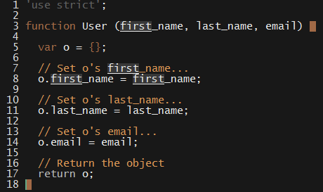

# 11.1 Lesson Plan - `this` is Not Madness

### Overview

This lesson will introduce students to the usage and internals of JavaScript constructors, and the rules for determining the referent of `this` bindings.

#### Instructor Objectives

Students should be able to:

* Use `this` within a constructor to assign properties to an object;

* Use the `new` keyword to call constructor functions;

* Write a function that emulates calling a constructor with `new`;

* Identify  the antecedent of arbitrary `this` bindings; and

* Write scope-safe constructors.

#### Instructore Notes

* Much of today's material is somewhat technical. Particular areas of concern are the following:

  * **Rules for this binding**. Some students might find this list intimidating, though there is nothing inherently difficult about the rules. Remind students that, should they forget the actual _rules_ for determining what `this` refers to, they can simply log the object in question to find the answer.

    * Apply this tactic yourself when convering scope-safe constructors (section 12): Simply log `this` from the `User` constructor in the activity, 

  * **call and apply**. The `call` and `apply` methods are common points of confusion. Explain that they allow us to "borrow" methods from objects without our having to copy the method's code.

    * Don't feel obliged to cover these methods in detail, as these aren't primary learning objects for today's lesson.

  * Feel free to have students do today's activities in pairs, rather than individually, if you feel it would make for a smoother learning experience.

* Have your TAs refer to the [Time Tracker](11.1-TimeTracker.xlsx) to remain on track.

- - -

### Class Objectives

Students should be able to:

* Create objects using constructors;

* Articulate the mechanics of calling a function with the `new` keyword; and

* Accurately identify what `this` refers to, wherever it appears.

- - -

### 1. Instructor Do: Creating Objects with Functions (0:10)

**Objectives Met**

* Identify  the antecedent of arbitrary `this` bindings

- - -

* Welcome students, and tell them that the topic of today's lesson will be a deep dive into JavaScript objects.'

* Remind students that objects give us a way to wrap up data (properties) and behavior (methods) into a single, modular package.

* Open up [todo.js](Activities/1-Factories/Examples/todo.js), and point out the properties and methods on the todo object.

_Properties and methods on our todo object._

* Ask a couple of students about objects they've created in their own work, and whether they've ever needed to create multiple, similar objects.

* Probably, some have. Ask them how they managed to create such similar objects in a reliable way; or, if they can think of a good way to do so, in the event they didn't.

  * If no student examples are amenable to this prompt, simply use the todo object: "HWat is a good way to create multiple todo objects, each with different titles and durations?"

* Explain that using a _function_ for this functionality is the best way to create multiple similar objects in a modular way.

### 2. Students Do: Create a `User` Factory (0:10)

* Slack out the following instructions to students.

* **Instructions**:

  * Imagine you're building a social network. This application will require you to keep track of users. Each user will have a first name; last name; and email address. Even though each user has the same properties, the value of those properties can differ between users.

  * Create a function that accepts these values as parameters, and returns an object that holds them as properties.

  * Your function should explicitly return this `User` object. You cannot use the `new` keyword in this exercise!

### 3. Instructor Do: Review Activity & Introduce Constructors (0:10)

- - -

**Objectives Met**

* Use `this` within a constructor to assign properties to an object;

* Use the `new` keyword to call constructor functions;

- - -

* Open up [User.js](Activities/1-Factories/Solved/User.js), and explain the solution. Point out the crucial steps:

  * Create a new object;

  * Set properties on the object; and

  * Return the object.

_The steps to constructing an object._

* Explain that JavaScript provides a shorthand for these steps.

  * Explain that, if we call a function with the `new` keyword in front, JavaScript will automagically do two things:

    * **Create an object**; and 

    * **Return it** for us.

  * Explain that, inside a function called with `new` the "variable name" referring to the object JavaScript creates for us is `this`.

  * Avoid mentioning that `new` calls also set the `constructor` and `[[ Prototype ]]` properties. The next lesson provides an opportunity to fill in this detail and complete students' knowledge of `new` calls.

* Explain that calling a function with the `new` keyword in front is called making a **constructor call**.

  * Explain that functions that set properties on an object and implicitly return are called **constructors**.

* Explain that functions written this way **must** be called using `new`.

  * Point out that the convention is to name such functions in CamelCase, as a hint to programmers using it.

### 4. Students Do: Create a `User` Constructor (0:10)

* Slack out the following instructions to students:

* **Instructions**:

  * Refactor your `User` function so that it can be constructor-called.

  * Remember the steps that JavaScript does for you. What lines in your function should you delete? Which should you modify?

### 5. Instructor Do; Review Activity (0:10)

* Open up [User.js](Activities/2-Constructors/Solved/User.js), and explain the solution.

* Ask a student to remind you of what happens behind the scenes when you call a functino with `new`.

  * As they do, annotate the solution with comments for the steps that constructor calls perform automatically.

  * Compare the constructor with the solution to students' previous exercise to demonstrate its relative brevity.

  * Create a `User` with both functions to demonstrate that they're equivalent.

  * Again, omit the detail of `constructor`, etc. We'll cover this later.

_Turning our function into a proper constructor._

### 6. Partners Do: Call `Person` Without `new` (0:10)

* Slack out the following instructions to students.

* **Instructions**:

  * We said you absolutely _must_ call constructors with `new`. But don't take our word for it—call your constructor without `new`.

  * Did you get an error? Or did everything "work"? 

  * What did you expect to happen? What actually happened? Why?

  * Recall the steps that calling a function with `new` automates. Which one of these still happen if you forget to use `new`? Which do not?

  * What do you think happened to `this`? What do you think happened with the property assignments? Don't worry about getting the "right" answer. Just come up with a best guess, and justify it.

  * As you can imagine, it's easy to forget to call a function with `new`, and people often do. With your partner, brainstorm ways to prevent this from happening. Don't worry if you don't know how to implement your solution—just come up with something conceptually reasonable.

- - -

### 7. BREAK (0:15)

- - -

### 8. Instructor Do: Review Activity (0:10)

* Ask a student to explain what the function returned when not called with `new`.

  * Ask the same student what they expected to happen.

* Explain that the functino returned `undefined` because it didn't contain an explicit `return` statement.

  * Remind students that a function with no `return` statement implicitly returns `undefined`.

* Ask a student to remind you of the steps that `new` automates. 

  * Ask a different student to explain which of these do _not_ happen when you forget to use `new`.

    * Explain that forgetting to use `new` means JavaScript **does not** create a new object for us; and it **does not** implicitly return it.

* Point out that the function didn't throw an error. It didn't behave as expected, but it "worked"—albeit incorrectly.

  * Point out that this implies that `this` still exists—otherwise we'd get a `ReferenceError`—but that it clearly can't refer to a new object if we forget to use `new`.

### 9. Instructor Do: Rules for `this` Bindings (0:20)

**Objectives Met**

* Identify  the antecedent of arbitrary `this` bindings; and

- - -

* Explain that the meaning of `this` changes, depending on where it's called/accessed.

* Explain that, if we call a function with `new`, then, inside that function,`this` refers to the object that JavaScript creates for us.

  * Use the `User` constructor to demonstrate this.

* Explain that, if we call a function as a method on an object, then, inside that function, `this` refers to the object the method was called on.

  * Put a function called `introduce` on the `User` you just created. Use `this` to print the user's full name. 

  * Write out the method call, **but before running it**, Ask a student to explain what they think the result will be.

* Briefly mention that that JavaScript has two functions, named `call` and `apply`.

  * Explain that these allow you to tell JavaScript what you want `this` to be inside of a function you run.

  * Tell students they will see this in action in the next exericse and review, and to put it on the back-burner until then.

* Explain that, if neither of these are the case, `this` refers to the global object by default.

  * Explain the notion of a "global object".

  * Explain that the global object in the browser is called `window`, and that, in Node, it's called `global`.

  * Call `User` without `new`. 

  * Ask a student what they think the property assignments did.

    * Did JavaScript ignore them? Or...?

  * Ask a student what `this` refers to in this case.

    * If they get stuck, walk them through the rules for `this` binding. 

      * Ask them what `this` means when you constructor-call a function.

      * Then, ask them what `this` means in a method call.

      * Next, ask them if this is a constructor call, or a method call.

      * Finally, ask them what this implies about what `this` must be.

  * Ask a student what this implies about the global object.

    * The correct response is that the global object should have a `first` and `last` property.

    * Ask a student what you would type to check if this is the case.

* Demonstrate that the global object does indeed have `first` and `last` properties.

* Explain that polluting the global namespace this way is bad practice codebase.

  * Explain that we'll see a way to eliminate this threat soon.

_Our User constructor is perfectly functional, but we made the mistake of calling it without the new keyword._

_Unwanted properties on the global object._

* Uncomment the `'use strict'` declaration at the top of the file, and demonstrate that JavaScript throws an error.

  * Explain that using strict mode helps prevent errors like this.

  * Exhort students to **always use strict mode**—this way, they hardly have to remember this is a problem!

### 10. Partners Do: Predicting `this` Referents (0:25)

* Explain that understanding what `this` refers to is crucial for effective object-oriented programming in JavaScript. 

* Slack out [this.js](Activities/3-this-Binding/Examples/this.js) and the following instructions.

  * **Instructions**:

    * In Section 1, what does `this` refer to? Explain to your partner why. Cite the rules for `this` binding to justify your explanation.

    * Uncomment the `console.log` statement, and run the file. Is this what you expected to see? If not, how can you explain the discrepancy?

    * Repeat the above exercise for the remaining sections, uncommenting each as you make your predictions. Be sure to run the log statements **only after** justifying your expectations with your partner.

    * The exercise on `call` and `apply` introduces functions you haven't used,yet. Basically, these allow you to call a method on any object in your program, but change the meaning of `this` within that function. Read the comments, run the examples, and explain what's going on to your partner.

    * Use `call` and `apply` to use the `introduce` method defined on a `User` to print the full name of an `Employee`. Why might this be a useful thing to be able to do?

    * It's okay if `call` and `apply` don't completely make sense, yet. Just experiment, and be prepared to share your thoughts to the class. 

### 11. Instructor Do: Review Activity (0:15)

* Open up [this_solutions.js](Activities/3-this-Binding/Solved/this_solutions.js).

* Call on different students to explain the solutions to the different exercises. 

  * Ask a student to explain what will happen when you uncomment a log statement; uncomment it; and congratulate them if they were right, or explain their mistake if they were wrong.

* Ask a student to explain what happened when they ran the `call` and `apply` examples.

  * Ask a different student to explain why this happened.

* Explain that `call` and `apply` allow us to call _any_ function, and _explicitly define_ what we want `this` to mean inside of it.

* Explain that this is useful if we want to `call` a method defined on, say, a `User`, to a similar object with a similar "shape"—such as an `Employee`—without having to duplicate the method.

* Explain that `call` and `apply` are functionally identical, but that `call` takes a comma-delimited list of arguments, whereas `apply` takes an array.

  * Demonstrate with the example in the bottom of `this_solutions.js`.

* Explain that, rather than repeatedly use `call` or `apply` to explicitly set the value of the `this` keyword on every call, you can use `bind` to set it permanently.

  * Explain that calling `bind` looks much like calling `call` or `apply`, but that it **returns a function** that you can call later, rather than calling the function right away.

_The usage similarity between call/apply and bind._

* Run the example in the bottom of [this_solutions.js](Activities/3-this-Binding/Solved/this_solutions.js) to demonstrate `bind`.

### 12. Instructor Do: Scope-Safe Constructors (0:10)

**Objectives Met**

* Write scope-safe constructors

- - -

* Now that students have a handle on `this`, revisit the problem of calling a constructor without `new`.

* Remind students that this results in the global object being used inside of the constructor.

* Give a few reasons that this is suboptimal.

  * E.g., it could overwrite the value of existing properties, etc.

* Explain that there _is_ a way to safeguard against this.

* Explain that JavaScript's `instanceof` operator allows you to check if a function was called with `new`.

  * Hold off on explaining that `instanceof` works by walking the prototype chain. We'll cover that in the next lesson.

  * Instead, simply teach that `instance` of "checks if an object is of a given type" (sufficient), or if it "was made by a given constructor" (better, but more technical).

* Open up [scope_safe.js](Activities/4-Scope-Safe-Constructors/Examples/scope_safe.js), and demonstrate that `instanceof` reports `true` when you call `Person` with `new`, and `false` otherwise.

_Using instanceof._

_Output of instanceof._

### 13. Partners Do: Bulletproofing `User` (0:20)

* Slack out the following instructions to students.

  * **Instructions**:

    * Revisit your `User` constructor. Modify it such that users can call it with or without `new`. 

    * Next, create a function that allows you to instantiate an `Admin`, which is a `User` whose 'admin' property is set to `true`.

    * Use `call` to reuse your `User` constructor inside of your `Admin` constructor. You should only explicitly set one property in your `Admin` constructor.

    * Try to make your `Admin` constructor scope-safe. 

    * Experiment with your attempt. Does it work as expected? if not, try to fix it, but don't worry if you can't. Just be ready to explain what didn't work as expected.

### 14. Instructor Do: Review Activity (0:10)

* Emphasize that it's okay if students didn't finish the entire exercise.

  * _But_, congratulate those who did!

* Open up the solution in [scope_safe_solution.js](Activities/4-Scope-Safe-Constructors/Solved).

_Scope-safe constructors._

* Explain the solution to the primary objective of making the `User` constructor scope-safe. 

  * Point out that this effectively checks if the user called the function with `new`; and, if not, just calls the constructor with `new` itself.

* Then, explain the solution to creating an `Admin` constructor.

  * Ask a student to explain why we were able to use `call` or `apply` this way. Specifically, ask:

    * What does `this` refer to?

      * The object created by the `new` call.

    * Why does `call` allow us to user the `User` constructor this way?

      * Because it lets us **explicitly define** what `this` should be within the function call.

  * Explain that `arguments` is an object that keeps track of the arguments passed to a function, and that it can be passed to `apply` as an array.

    * Explaining that `arguments` isn't _technically_ an array probably isn't worth it. But, feel free to mention it if you feel compelled.

* Explain that the next point is a subtle one.

  * We want our Admin users to be instances of both Admin _and_ User. 

    * Feel free to give an explanation for this: "This ensures that tools built for `Users` will still work for `Admin`s, but tools built specifically for `Admin`s won't work for general `Users`.

  * Demonstrate that this doesn't work as expected. Log the `instanceof` output.

* Quickly demonstrate that setting the prototype property on `_Admin` fixes this problem.

_Delegating constructors._

* Explain that **prototypes** are a tool that allow us to create relationships between different objects.

* Explain that we'll take a deep-dive into prototypes in the next lesson.

  * Reassure students that they don't need to understand how this works, yet—this example is simply to show that we can fix the problem with rather little code.

  * Encourage students to research prototypes before the next lesson.

- - -

### Copyright

Coding Boot Camp © 2016. All Rights Reserved.
