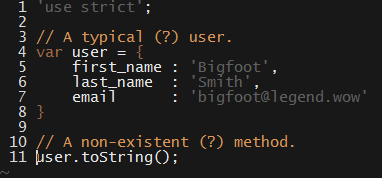
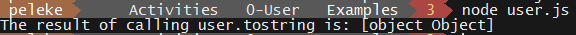
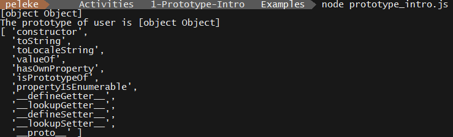
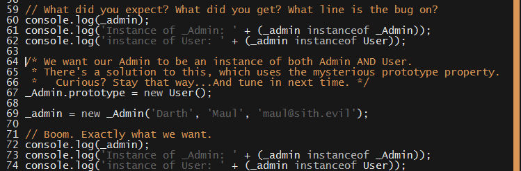
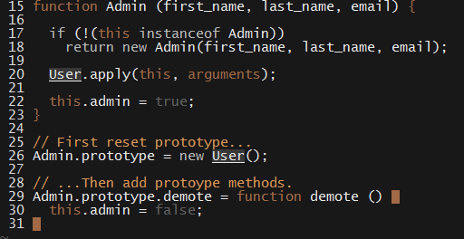

# 11.2 Lesson Plan - Prototypes

### Overview

#### Instructor Objectives

Students should be able to:

* Add properties to an object's prototype chain;

* Access properties along an object's prototype chain via delegation;

* Use `Object.create` to implement delegation behavior.

#### Instructor Notes

* In JavaScript, all objects are associated with a "prototype object", exposed by `Object.getPrototypeOf(target)`. All Functions have a `prototype` property, exposed by accessing `prototype`, which is _distinct_ from the object returned by calling `Object.getPrototypeOf` on the function.

  * Within the lesson plan, we refer to the prototype object associated with objects and exposed by `Object.getPrototpyeOf` as the \[\[Prototype]], in accordance with the specification, and refer to a function's `prototype` property simply as its `prototype`. 

  * This is done so as to disambiguate within the lesson plan. In class, it's clearest to refer to both entities as a prototype, and emphasize the difference.

* Certain aspects of today's material might be difficult for some students to follow. 

  * Prototypes aren't inherently _difficult_, but there is a lot to explain. Proceed slowly, and ensure students understand the notions of **delegation** as the primary learning objective of today's lesson.

    * All sections after the break—those on "Extended Relationships" and `Object.create`— can be abbreviated. The section on `Object.create` can be omitted entirely, or discussed in Saturday's lesson.

* Have your TAs refer to the [Time Tracker](11.2-TimeTracker.xlsx) to stay on track.

- - -

### Class Objectives

Students should be able to:

* Use prototypes to delegate property access from one object to another; and

* Use `Object.create` to achieve the same delegation behavior while avoiding direct manipulation of `prototype`s.

- - -

### 1. Instructor Do: Prototypes in JavaScript (0:15)

**Objectives Met**

* Use prototypes to delegate property access from one object to another; and

- - -

* Remind them that prototypes allow one to link objects to other objects.

  * Explain that, to understand prototypes, we first need to review property access.

  * "But, to understand prototypes, we have to take al look at how you look up properties on an object..."

* Call on a student, and tell them to imagine they have a `user` object that has three properties: A `first_name`, a `last_name`, and an `email`.

  * Ask them how they would get the value of the `email` property.

  * Next, ask them what would happen if you spelled it wrong, and tried to access the `emai` property.

    * If they don't know the answer, encourage them to experiment in the console for the answer.

* Next, live-code such a `user` object, and have the class follow along.

_Your user object, and a non-existent (?) toString call._

* Then, write out a call to `toString`, but **wait to call it**.

  * Before pressing return, ask a student to remind you what the class has just decided will happen when accessing a non-existent property.

  * Ask another student to tell you what they expect to happen.

  * Hit return.

_Useless, but...Unexpected._

* Point out that, while this is useless output, our code _clearly_ called something, somewhere, to produce it.

* Explain that **prototypes are responsible for this behavior**.

* Explain that all objects contain a pointer to another object. That pointer is called the object's **prototype** (\[\[Prototype]]).

* Explain that, if you access a non-existent property on an object, **JavaScript checks if the object's prorotype has that property**.

  * Explain that, if the prototype doesn't have such a property, JavaScript checks the prototype's prototype object, and so on.

  * Explain that, if no prototype object along the chain has such a property, JavaScript returns `undefined`.

* Students may begin getting uncomfortable at this point. Reassure them that this takes some time to get used to, and that it's okay if it doesn't "click" right away.

### 2. Everyone Do: Sharing Common Methods via Prototype(0:15)

* Explain that everyone will work through the first example of setting up a prototype chain together.

* Tell students to code along with you.

  * The "script" for this exercise is in [prototype_intro.js](Activities/1-Prototype-Intro/Examples/prototype_intro.js). it's best if you either memorize the steps, or refer to it briefly after each step. This way, students can live-code along with you.

* Point out that, the last time we created a `user`, we were able to call its `toString` method, even though we didn't define one on `user`.

  * Point out that this implies JavaScript "magically" added a \[\[Prototype]] linkage. 

* Explain that you can get an object's \[\[Prototype]] by using `Object.getPrototypeOf`.

* Write a statement logging the result of calling this function on `user`. 

  * Ask a student what the expected output should be.

* Explain briefly that, to actually see the key/value pairs for each property, we need to use `Object.getOwnPropertyNames`.

  * Feel free to explain enumerable vs non-enumrable properties if you'd like, but it's not essential for the lesson.

_A-ha! There's toString!_

* Reassure students that they don't need to be familiar with every property they just logged, or with the `Object.getOwnPropertyNames` function.

  * Emphasize that the major point is that **this prototype is an object**; and that object has a property called `toString`, which JavaScript was able to find!

* Next, ask a student to remind you what happens if we try to access a non-existent property on `user`.

* Write a statement calling `user.introduce`. **Before calling it**, ask a student to explain the expected output.

* Call the function. Point out that it throws a `ReferenceError`, just as expected.

* Then, define a function called `introduce`, that prints the `user`'s first and last name.

* Ask a student where you need to "put" this method in order for our broken `user.introduce` call to work.

* Attach `introduce` to the `user_prototype`. Run your code again.

* Demonstrate that everything works as expected, even though `user` has no `introduce` method defined directly.

### 3. Partners Do; Demystifying the prototype Property (0:30)

* **Note**: This is a potentially challenging activity. Feel free to work through it in **Everyone Do** style, if you'd like.

* Explain that there is nothing stopping _different_ objects from sharing the _same_ prototype.

* Remind students of the `User` constructor we created in the last class.

  * Point out that `User` objects will all have common behavior. They will all be able to `introduce` themselves; reset their email address; etc.

* Explain that JavaScript lets us put all these methods on a _single_ object, which _everY_ `user` links to as its prototype.

* Tell students that the next activity will guide them through JavaScript's mechanisms for setting this up.

  * Reassure them that most of this is conceptually identical to what they've already seen.

* Slack out the [prototype_property_start.js](Activities/2-prototype-Property/Examples/prototype_property_start.js) file. 

  * The file contains instructions, so there is no need to slack these out separately.

* Be sure to walk around and be proactive in helping students through the exercise. 

  * They're well-prepared for this exercise, and actually don't have to write much code. But, they may feel intimidated by having to work through new material on their own. Reassure them that the activity contains nothing beyond what they just learned, and encourage them to ask questions if they get stuck.

  * Since there is relatively little coding with this exercise, students are likely to finish early. The extra time is allotted to ensure everyone has ample time to think through the prototype system.

### 4. Instructor Do: Review Activity (0:15)

* Congratulate students on their having wrapped their head around a challenging concept.

* Open up [prototype_property_solutions.js](Activities/2-prototype-Property/Solved/prototype_property_solutions.js).

  * Remind students that all JavaScript objects have a prototype.

  * Point out that constructors are used to create multiple objects with **similar behavior**.

    * Explain that allowing all of these objects to share a prototype allows us to implement "shared" methods _once_, on a _single_ object.

  * Explain that, rather than requiring that we use `Object.getPrototypeOf` on an instance, JavaScript allows us to easily update the prototype of all objects created with a given constructor by accesing the constructor's `prototype` property.

    * Emphasize that `prototype` **is different** from the attribute returned by `Object.getPrototypeOf`.

    * Explain that **only functions** have a `prototype` property. 

  * Explain that attaching properties and methods directly to the object referenced by a constructor's `prototype` allows us to perform exactly the same kind of behavior delegation we achieved in the **Everyone Do** exercise, but for **all objects created with the constructor**—even those created _before_ you made the change.

  * **Your priority** is to make sure students understand the conceptual relationship between a constructor's `prototype` property and the attribute returned by `Object.getPrototypeOf` in the last exercise.

    * Namely, that the constructor's `prototype` is the same object returned by calling `Object.getPrototypeOf` on an instance.

  * Spend as much time as necessary explaining this concept. 

* Once students are clear on this point, step through the rest of the exercise. 

  * At each step, ask a student to explain the expected output.

* Congratulate students again on having made it this far. Point out—truthfully—that JavaScript's prototype system is notoriously quirky. Reassure them that, even if their knowledge is still shaky, they're well on their way to mastering it.

- - -

### 7. BREAK (0:15)

- - -

### 8. Instructor Do: Extended Relationships (0:15)

- - -

**Objectives Met**

* Use prototypes to delegate property access from one object to another

- - -

* Point out that we have yet to dig into the code we wrote towards the end of the last lesson.

  * Remind them of the code sample they saw at the end of their previous class.

_The prototype property._

* Remind students that the left operand to `instanceof` is an _object_, and that all objects have a \[\[Prototype]].

* Remind students that the right operand to `instanceof` is a _constructor_, and that all constructors have a `prototype`.

  * Ask a student to remind you what the relationship between a constructor's `prototype` and an instance's \[\[Prototype]] is.

* Explain that `instanceof` works by checking of the constructor's `prototype` appears somewhere on the instance's prototype chain.

  * I.e., if the constructor's prototype is denoted `p`, JavaScript checks if `Object.getPrototypeOf(instance) === p`.

    * If it doesn't, JavaScript recurses up the chain.

    * If the property is found _at any point_, `instanceof` returns true.

    * Otherwise, it returns false.

* Open up [admin.js](Activities/3-Extended-Relationships/Examples/admin.js).

* Point out that we set `Admin.prototype = new User()`, _before_ adding methods to `Admin.prototype`.

_A nebulous line of JavaScript..._

* Explain that we'll work through what happens in `admin instanceof User` step by step.

  * Remind students how `instanceof` works. Ask a student what the first step will be.

    * Answer: JavaScript checks if `Object.getPrototypeOf(admin) === User.prototype`.

  * Ask a student if this is the case.

    * Answer: No.

  * Ask a student what the _next_ step will be.

    * Answer: Set `const _proto = Object.getPrototypeOf(admin)`. JavaScript will check if `Object.getPrototypeOf(_proto) === User.prototype`.

  * Ask a student if this is the case.

    * Answer: Yes. We set `Admin.prototype = new User()`, so `Object.getPrototypeOf(_proto) === User.prototype` be construction.

* Point out that, while this might feel unnatural, it's not inherently _complicated_. Ultimately, it boils down to remembering and applying a handful of rules. Reassure students that it becomes second nature with time.

### 9. Instructor Do: Delegating to Person (0:15)

* Slack out the following instructions to students:

  * **Instructions**:

    * You've seen how to make `admin instanceof User` return `true`. Your task is to create a `Person` constructor, and set up the prototype chains such that `admin instanceof Person` returns true.

    * Don't forget that `user instanceof Person` should also return true. 

    * Make sure your constructors are all scope-safe!

    * Your hint is this: You shouldn't change the value of `Admin.prototype`.

### 10. Instructor Do: Review Activity (0:10)

* Ask students to raise their hands if they got things to work.

* Call on a successful student to explain what they did.

* Briefly show the [solution](Activities/3-Extended-Relationships/Solved/person.js) to the class.

* Point out that the solution is identical in form to the code you walked through in the previous section.

### 11. Instructor Do: OLOO (0:10)

- - -

**Objectives Met**

* Use `Object.create` to achieve the same delegation behavior while avoiding direct manipulation of `prototype`s

- - -

* Explain that, under the hood, _all_ object-oriented programming in JavaScript implies the use of prototypes.

* But, explain that there _is_ a way to implement delegation behavior without using `prototype` properties directly.

* Open up [oloo.js](Activities/4-OLOO/Examples/oloo.js), and explain the following points.

  * Explain that `Object.create` creates a new object whose \[\[Prototype]] is equal to the argument you pass.

    * E.g., `Object.create(null)` creates a new object whose \[\[Prototype]] is `null`.

  * Explain that this new object will delegate attempted acceses of non-existent properties to the object you pass to `Object.create` as argument.

* Point out that it's possible to use `Object.create` in place of direct `.prototype` manipulation, if desired.

  * Explain that this is useful when you want to share behavior between conceptually unrelated constructors, such as a `Logger` and an `Admin`.

  * Explain a few of the ways this approach is different from the traditional one:

    * It eliminates the need to refer to functions``prototype\` objects.

    * It eliminates the need to call constructors with `new`.

    * We can write our code in terms of _objects which share behavior_, rather than having to manipulate the prototype chain.

      * This also means that we can no longer use `instanceof`, because we don't manipulate the prototype chain.

### 12. Partners Do: Translate the Person Hierarchy (Optional) (0:30)

* This is a potentially challenging exercise. Feel free to step through it in **Everyone Do** style; or, to explain the solution code; instruct students to implement it themselves; and review again after. Use your discretion.

* Slack out the following instructions to students:

  * **Instructions**:

    * Consider the Person->User->Admin hierarchy you've built. For the sake of exercise, use `Object.create` to replace the `.prototype` references responsible for enabling proper `instanceof` behavior.

    * Before you write a single line of code, explain to your partner why these lines look like they do in the first place.

    * Then, explain to your partner what `Object.create` does.

    * Finally, refactor your code. Keep in mind that you'll have to turn your `Person` constructor function into an _object_. How would you do this?

    * Similarly, your `User` constructor function will become an _object_. How would you use `Object.create` to create it?

    * Create a constructor-like function on the new `User` object. Call it `init`. It will be very similar to the constructor you had before, but it will contain a `return` statement. What should this function return?

    * Finally, duplicate the process of refactoring `User` to refactor `Admin`.

    * Be sure to change only one `.prototype` reference at a time. Make sure everything works exactly as before before moving onto the next refactor.

    * When you're finished, create a `Logger` object. Give it a method called `danger`, which prints whatever warning message you pass it in caps; and one called `info`, which simply logs the string you pass it.

    * How do you make `Logger` methods available to objects created by either `User.init` or `Admin.init`?

### 13. Instructor Do: Review Activity (0:10)

* Open up the [solution](Activities/4-OLOO/Solved/person.js). Explain why the replacement of `.prototype` references takes the form that it does.

* Point out that all it takes to make `Logger` methods accessible to objects created by any of your three constructors is to set the prototype of `Person` equal to the `Logger` object.

  * Ask a student to explain why this works, or simply explain it yourself.

* Take some time to address any questions or confusions that may arise. 

* Congratulate students on their work today! Explain that prototypes are a fundamental tool of JavaScript programming, and mastering them brings students that much closer to becoming experts.

- - -

### Copyright

Coding Boot Camp © 2016. All Rights Reserved.
