## 19.4 Lesson Plan – React ES2015 and Beyond

#### Overview

In this class we will expand upon the brief introduction to ES6 React syntax from last class. 

- - -
#### Instructor Priorities

* Students should understand the concept of functional and class components.

* Students should understand the filter method, ES6 map method, and become familiar with other new ES6 features such as object destructuring, const and let.

* Students should become familiar with ES6 import and export statements

- - -
#### Instructor Notes

* It's expected that you were able to go over the ES6 Demo Activity from the previous class. You may be able to get by without having done this, but consider revisiting that activity first and coming back to this. In particular students are expected to have at least a high level understanding of arrow functions, object destructuring, const and let variables.

* Expect today's class to be a challenging one for many students. While some students may already be somewhat familiar with React ES6 syntax or ES6 in general, this will be completely foreign to many. If possible, try and identify students on both ends of the spectrum and pair them up into groups before or during class to make this lesson an easier experience.

* Despite the challenge, these concepts ARE important. While the React.createClass helper is still partially supported for now, eventually it will be phased out in favor of ES6 class syntax. Additionally, most companies using React and most of the learning material on the subject will use ES6 syntax. Once understood, these new features truly make the library a joy to work with.

* Instructors/TAs: Spend the appropriate amount of time before class familiarizing yourself with the code. In particular, the functional component vs class component syntax and how it translates to the ES5 syntax students have become familiar with.

* Be sure to highlight that most of the new material in this lesson is not specific to React, but new features of the JavaScript language.

* Have your TAs reference [19.4-TimeTracker](19.4-TimeTracker.xlsx) to help keep track of time during class.

- - -

### Class Objectives

* To be able to write a React application using a combination of class and functional components.

* To understand and use map and filter array methods and how they may be used inside of React code.

* To become more familiar with the ES6 import/export statements as well as recognize other new syntax such as object destructuring, const and let, and shorthand method syntax.

- - -

### 1.  Instructor Do: Welcome Class (0:05)

* Welcome students. Explain today we will be diving deeper into the React library as well as covering using React with ES6. While some of this new syntax will appear unfamiliar when it comes to creating components, assure students all of their previous knowledge and experience transfers over and there's really only a few differences to be aware of.

* Inform students that none of the material taught today will be necessary to complete the homework assignment, they already know everything they need to know for that. Many of the features we'll go over today may be helpful for the homework, but they aren't required.

* While we will cover a lot of ground over the next two days, there's always more to learn. Some extra resources have been added to the student guide to learn more about react, react-router, and ES6. In addition to reviewing the activity solutions after class, students should check these out as well.

- - -

### 2. Instructor Do: Demo Class Components (0:15)

* Open and run the [`01-Class-Components`](Activities/01-Class-Components) activity. Demo the very simple application's functionality in your browser.

    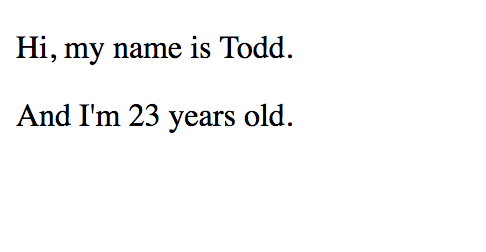

* Then open `App.js` file and point out the import statements at the top of the page. While this new syntax does offer us some more flexibility, explain that in this case, we're importing React and ReactDOM very much the exact same way we have been doing with the require statements we're used to. We'll expand on this a bit later, but for now, it's best not to get stuck on it.

  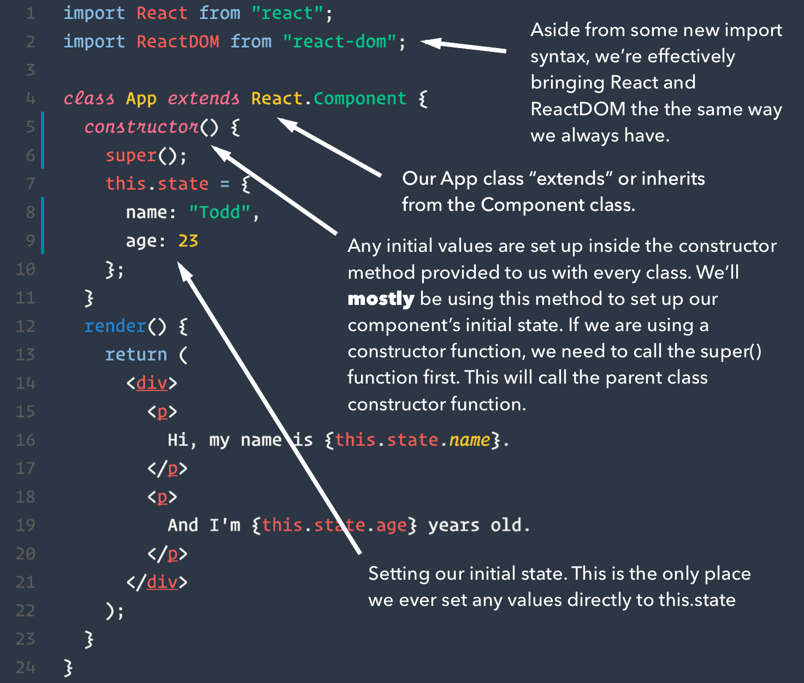

* Highlight the `class App extends React.Component` syntax. Ask students if any of them know what this might mean. Some may have come from object-oriented programming languages where they've seen similar syntax before.

  * Explain that under the hood of the `React.createClass` helper method we're used to, there's a JavaScript constructor function (just like the constructor functions they learned about a few weeks ago). It creates and returns a React Component object.

  * In a nutshell, ES6 classes are cleaner, more organized JavaScript constructor functions. They can be passed parameters, just like ES5 constructor functions, they create an object, just like ES5 constructor functions.
  
  * The `extends` keyword means, I want to take this existing class, `React.Component`, and I want to create an entirely new class, `App`, with all of the features and properties of the parent class (`React.Component`). Long story short, this is some of what React.createClass is doing under the hood. We're now taking advantage of some of the power of ES6 removing a now unnecessary layer of abstraction.
  
  * Inside an ES6 class, we can define a constructor method (not to be entirely confused with ES5 constructor functions) which is required if we need to set up any initial values. For our purposes, we'll **mostly** be using this as a substitution for the `getInitialState` method. Point out the assignment to `this.state` inside the constructor. This is the **ONLY** time we ever write anything directly to the state object. For any subsequent state changes, we'll still use `setState` method we've become accustomed to.
  
  * Some other unfamiliar syntax here includes the `super()` function call inside the constructor function. This is required whenever we "extend" a class and need to use the `this` keyword inside of a constructor function. This calls the parent's constructor first before executing the child class's constructor. It's not terribly important to completely understand here and webpack will give us a compile error explaining this if we forget to call `super`. It can just be considered necessary boilerplate for now.
  
  * Lastly point out the shorthand object method syntax. We aren't using commas or colons or the function keyword to define our class methods (render and constructor). This is just shorthand syntax we get for free with ES6 objects of any kind. [Go to Docs](https://developer.mozilla.org/en-US/docs/Web/JavaScript/Reference/Functions/Method_definitions).

- - -

### 3. Partners Do: Class Component with Props (0:10)

* Zip and slack out the following folder and instructions:

  * Folder: [`Unsolved`](Activities/02-Class-Components-With-Props/Unsolved)
  
  * **Instructions:**
  
    * With your partner unzip and open the folder just slacked out to you. Choose to complete either the easier or harder version of the assignment.
    
    * Open your selected assignment in terminal and run `npm install`.
    
    * In Sublime, navigate to the `CounterDisplay.js` file and complete the component skeleton so that it renders and displays `this.props.count` being passed to it by its parent component `App`.
    
    * **Hint**: If you get stuck, look at the `App.js` file as a reference to some of the new class component syntax, or if on the harder assignment, take a peek at the easier version which has a little more of the missing code filled in.
        
- - -

### 4. Instructor Do: Review Class Components with Props Activity (0:15)

* Slack out the [`Solved`](Activities/02-Class-Components-With-Props/Solved) version of the Class Component with Props activity.

* Open the solution. In your browser demonstrate how when we click the buttons the counter will either go up or down. 

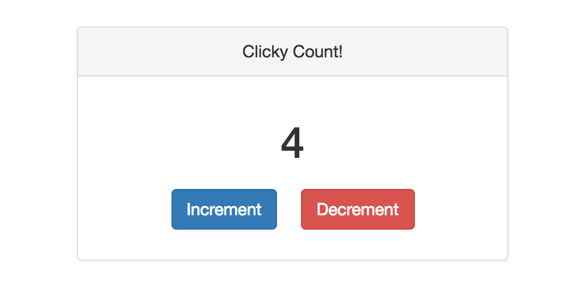

* Open the `CounterDisplay.js` file in your Sublime editor and go over the code.

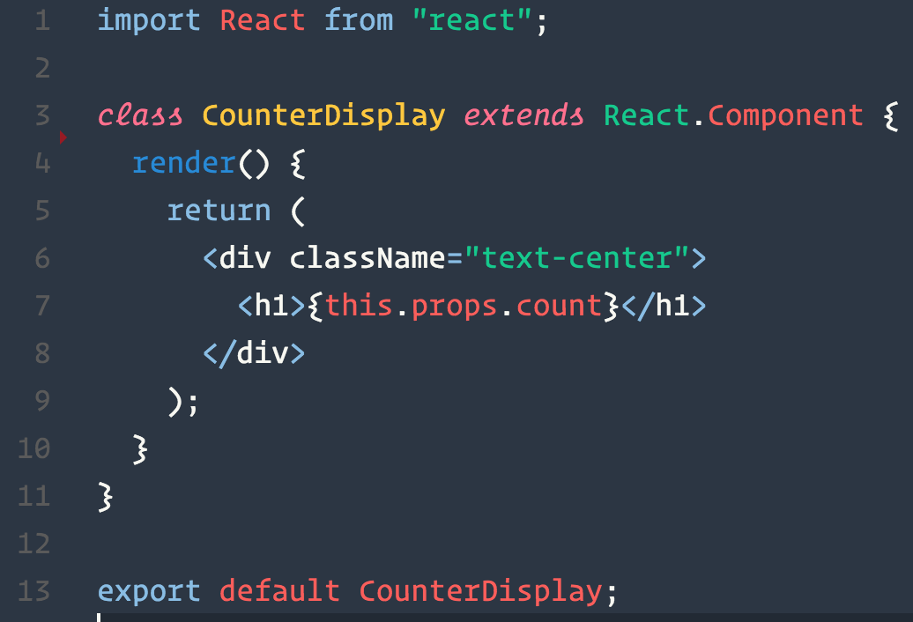

* In particular, make sure everyone can explain to you what's happening:

  * On line 1 with the ES6 import statement.
  
  * On line 3 where `class CounterDisplay extends React.Component`
  
  * What `constructor` and `super` are for. Why don't we need them here?
    * They're for setting up initial values in our components such as initial state or binding custom methods to our component. We don't need a `constructor` method here because this component doesn't have any state or custom methods. (more on this later)
  
  * What they think the `export default` statement on the last line does?
  
    * It's similar to module.exports, except stricter rules are enforced where this is the **only** module to be exported from this file. It's important to note that if you export with ES6 syntax, you should also import with ES6 syntax. For the most part, you can mix ES5 and ES6 all you want without any code breaking issues, but you should be consistent here as there are a few areas where this can yield unexpected results.

* Now open the `App.js` file in Sublime which was completed for us from the start of the activity.

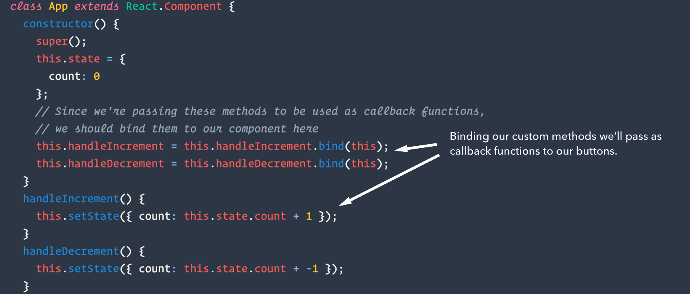

* Point out all of the similar syntax with the import statements, the class extends syntax, the constructor and super methods. 

* Then point out where we bind the `handleIncrement` and `handleDecrement` methods inside the constructor. Explain that the value of 'this' may change inside of a custom method depending on where it's run. So we may have difficulty accessing things like `this.state` or `this.props`.

* This most commonly happens when a method is passed as a prop to another component or JSX element. For example, `this` will change inside of any method passed to respond to an event listener such `onClick`. In these cases, we probably want to bind these methods inside the constructor. If we didn't bind a method inside of the constructor, and the method uses `this.setState` inside of it, `this` now doesn't refer to the component we mean to set the state of.

* If this last point seems confusing, it generally doesn't hurt to always bind a component's custom methods inside its constructor for now. But it's not always necessary to do.

* Next scroll down to the section where we apply inline styles to our panel and buttons.

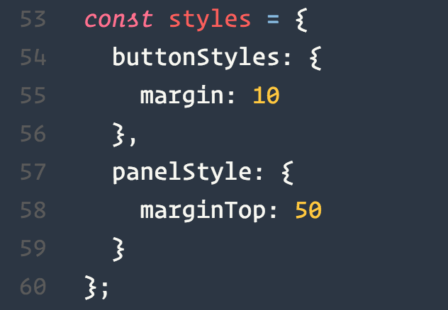

* Explain that just like regular HTML, we can apply inline styles to JSX elements. This goes on the `style` prop of the component we want to style. This is totally optional and isn't suitable for **all** styles, but it can be useful if we want to scope particular styles to just one component rather than have them globally scoped inside of a CSS stylesheet, or pass styles as props from one component to another.

* Inline styles can also be useful if we need to make any styles dynamic since these are just JavaScript objects which can be changed as the data changes.

* The main things to be aware of with inline JSX styles is that dash-cased property names need to be camelCased, and the value needs to be a string in quotes or a number. Units of measurement will default to pixels if another unit is not specified.

- - -

### 5. Instructor Do: Introduce Functional Components (0:10)

* In this example we will go over functional components vs class components.

* Either live code this example using the solution from the last exercise as a starting point or open the [Functional Class Comparison](Activities/03-Functional-Components-Comparison) folder and demonstrate the differences between the two files.

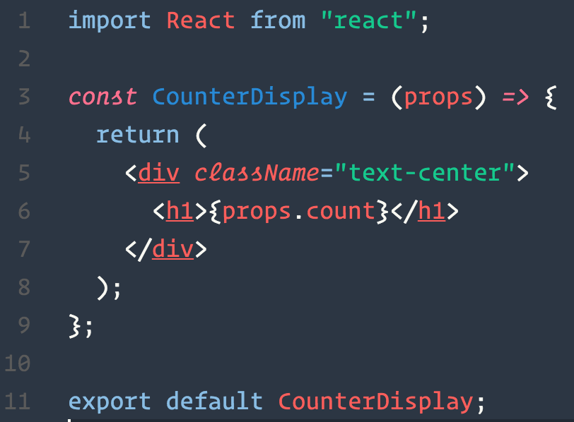

* Explain to students that whenever a component doesn't need to keep track of or manage any of its own state, we can optionally make it a functional component. Essentially this involves wrapping and returning our JSX from a function rather than inside an ES6 class. This type of component often requires less code to write.

* Aside from this syntax being shorter, these components, are generally easier to reason about, easier to debug, easier to test.

* With functional components we don't have to worry about the `this` keyword. We access props with `props.<propName>` syntax.

* There are some caveats to using functional components, including:

  * No component state, only props and local variables.
  
  * No lifecycle methods for functional components.
    
* Assure students there's no need to stress about deciding when to use functional or class components. It's possible to create entire applications and never use functional components, though it's considered a best practice to do so when possible. For now, it's mostly important to recognize what's going on when they see this in other people's code.

- - -
### 6. Instructor Do: Introduce Array.prototype.map (0:10)

* Let students know that in addition to ES6 classes and arrow functions, we have a few other helpful new features such as some new array methods we can use to traverse and manipulate array elements. One of the most popular when it comes to React is the map method.

* Explain to students that map is an array method that takes an existing array, runs a callback function once for each item in the array, and then returns a brand new array with the return values of each callback function. 

* Open the [Map Exercise Unsolved](Activities/04-Map/Unsolved/mapUnsolved.js) file in Sublime

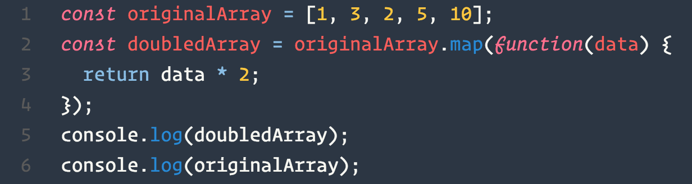

* Either run this code using Node or in your Chrome console to help show students what's going on here.

* Be sure to highlight the fact that map doesn't modify the original array. It returns an entirely new one instead. 

* The map method is also an expression which returns a value, the new array, so unlike a for-loop, it can be evaluated right inside of JSX curly brackets.

* Answer any questions before the start of the next exercise.

- - -
### 7. Students Do: Map Exercise (0:10)

* Slack out the following file and instructions:
  * File: [mapUnsolved.js](Activities/04-Map/Unsolved/mapUnsolved.js)
  
  * Instructions:
  
  * Using the `doubledArray` map as an example, create the following:
  
    * A map that takes in the original array and returns a new tripled array.
    
    * A map that takes in the original array and returns a new array with the string "even" at the positions where there were even numbers and the string "odd" where the numbers are odd.
    
    * A map that takes in the moviePatrons array provided, and returns a new array containing each moviePatron object with a new "oldEnough" property added. oldEnough should be set to true if the patron is 17 or older, and false if they are younger than 17.
    
  * Check out the mozilla documentation on Array.prototype.map if stuck:
  
  * <https://developer.mozilla.org/en-US/docs/Web/JavaScript/Reference/Global_Objects/Array/map>

- - -
### 8. Instructor Do: Review Map Exercise (0:10)

* Open the [mapSolved.js](Activities/04-Map/Solved/mapSolved.js) in Sublime. Go over each exercise solution as a class.

* Highlight the fact that whatever we return inside our callback function is what goes into the array for that iteration.

* Note how we can do more complicated logic in our maps like in the movie patrons solution.

* Explain that maps are especially powerful in React as they can be used to loop over an array of data, and return some JSX using that data. If this doesn't make complete sense yet they'll have an opportunity to practice in an exercise a little later today.

* Answer any questions before the break.

- - -

### 9. BREAK (0:15)

- - -

### 10. Instructor Do: Introduce Array.prototype.filter (0:05)

* Let students know another powerful tool we have is array filtering.

* The filter method is structured exactly like the map method. But instead of returning one array element for each item in the original array, filter only returns elements to the new array that pass our test. 

* Open the file [filterUnsolved.js](Activities/05-Filter/Unsolved/filterUnsolved.js) in Sublime and go over the first example.

    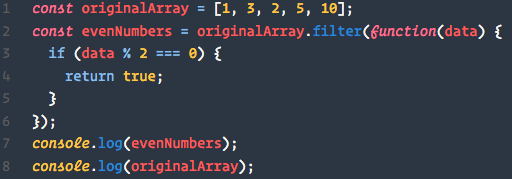

* Either run the filter in Chrome dev tools or using node. Be sure to show how in the given example the returned array contains only even numbers.

* In a map, the value the callback returns is what goes into the new array at that index. For filter, it expects us to return a truthy or falsey value. If the returned value is truthy, the specified element in the original array is added to the second array, otherwise, it is skipped.
  

- - -

### 11. Students Do: Array Filtering (0:05)

* Slack out the following file and instructions:

  * File: [filterUnsolved.js](Activities/05-Filter/Unsolved/filterUnsolved.js)
  
  * Instructions:
  
    * Using the first example as a reference, use array filtering to complete the following:
    
    * Take the `moviePatrons` array and return a new filtered array only containing patrons where the age is more than or equal to 17.

- - -

### 12. Everyone Do: Review Array Filtering Activity (0:05)

* Go over [filterSolved.js](Activities/05-Filter/Solved/filterSolved.js)
 as a class.

* Point out that we can optionally use an arrow function for callback functions in both map and filter. We'll probably be using arrow functions for these more often than not when using React since the "this" keyword is normally different inside the callback function.

* Let students know not to worry if this syntax is confusing, they're about to get some practice with mapping inside JSX in the next activity.

- - -

### 13. Students Do: Component Map Activity (0:15)

* Zip and slack out the following folder and instructions:
    
  * Folder: [`Unsolved`](Activities/06-Component-Map/Unsolved)
  
  * Instructions: 
      
    * Open and unzip the folder slacked out to you.
    
    * Run `npm install` to install dependencies and then `webpack -w` to build the webpack project. 
    
    * Navigate to the `App.js` file. Notice how this component has an array of objects on state which is passed to the List component on the `data` prop. 
    
    * Now navigate to the List.js file. Here we want to accomplish the following:
    
      * Goal 1: We want to create a map of our list items passed on the `data` prop and return an `li` tag with the text of each list item inside. We want to execute this inside of the `list-group` ul.
      
      * Goal 2: Once we've successfully mapped our list inside of this component, we want to give each li element a key prop equal to the id of the list item.
      
      * Goal 3: Once we've completed goal #2, try refactoring your component so that list is destructured off of props in the same way `style` is in this component.
      
      * **Hint**: Remember that whenever you want to execute JavaScript inside of JSX, we need to escape the JSX with curly brackets {  }

- - -

### 14. Everyone Do: Review Component Map Activity (0:10)

* Spend a few minutes going over the solution as a class. Make sure students understand what we're doing inside the map function.

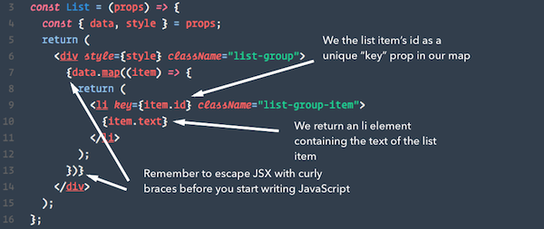

* Explain to students that since a map is a function which returns a value, it can be used inside of our escaped JSX to return some data. This wouldn't work in this way with a for-loop, since a for-loop doesn't return a value, instead, it's used for side-effects.

* Explain to students that React is smart enough where if we try and render an array of JSX, it knows to render that JSX as separate elements.

* Touch upon the `key` property on the mapped li tag. Explain that while we can technically compile our code without this, we will get a warning about it. That's because to be as efficient as possible, React prefers the outermost parent of any mapped elements to have unique key props. This is to help it keep track of these elements, so in the case of a re-render, it won't need to re-render the **entire** list, just the values that change.

  * We could technically get the index of our mapped element in the callback i.e. `array.map(data, index) => { ....}`, however, the index isn't really unique to our data, just it's position in the array. A unique id of some sort is preferred. In the real world, we'll often we'll be getting data from a database and can use the id provided from that.

- - -

### 15. Partners Do: Seymour ES6 Revisited (0:30)

* Inform students that they will be taking the FeedMe Seymour application they worked on the other day and converting it to use ES6. Additionally, they'll have the opportunity to not just convert components, but to also refactor some of the code to use features like mapping and destructuring.

* This exercise will likely take up the duration of the rest of the class. Instructors and TAs should be walking around offering support during this exercise.

* Zip and slack out the following folder and instructions:

  * Folder: [`Unsolved`](Activities/07-Convert-Seymour/Unsolved)
  
  * Instructions:
      
    * Unzip and open the folder slacked out to you.
    
    * Run `npm install` followed by `webpack -w` to build and watch the project.
    
    * Convert all components to either class or functional components.
    
    * Use ES6 import and export statements where applicable.
    
    * Bind any custom methods you need to pass to children with `this.methodName = this.methodName.bind(this);` syntax. This will help preserve the 'this' keyword to the intended component. 

    * **Challenge**: 
    
      Currently, our application isn't very DRY. Our three different Child components are exactly the same except for different images and text, both of which can be passed as props. And since none of these Child components ever modifies their own food value, that value can be passed as a prop as well.
  
      Find a way to refactor this application so that we only have two components in our project, Seymour, and one Child. Our refactored application should look and function exactly the same. Hint: You will probably need to use the map method.
                    
      Complete the initial assignment first, but ask a TA or instructor for assistance if stuck on the challenge.

- - -

### 16. Instructor Do: Review Seymour ES6 Revisited (0:10)

* Zip and slack out the [Solution](Activities/07-Convert-Seymour/Solved) folder.

* Open the solution in Sublime and go over it as a class.

* Highlight how we used ES6 import and export statements throughout our files

* Show students how we bound our custom methods inside of the constructor function for the Seymour component.

* Show students how we stored all of the data needed for our different food panel child components in `this.state.data`. In the real world, this data might be coming from an API call or JSON instead first. 

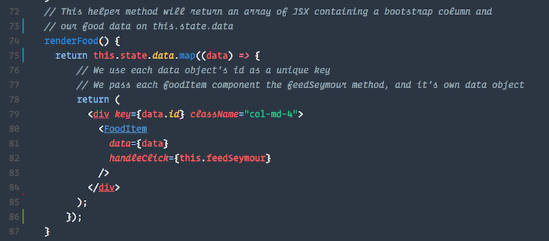

* A little lower, we define a `renderFood` method which maps through all of the food data and returns our FoodItem component with different props passed through each time. We call `this.renderFood()` at the bottom of Seymour's render function. We could have done the map right inside the render function like we did in the previous example, but we can optionally use a helper method which returns the mapped JSX. We did it this way since our render function is already a little cluttered.

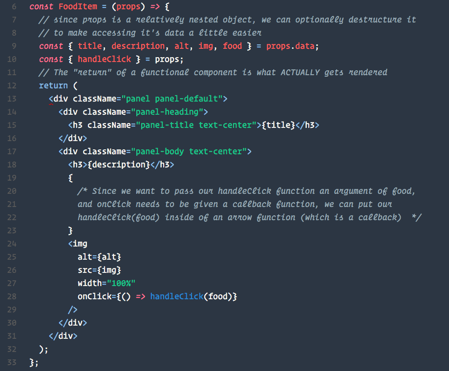

* Navigate to the `FoodItem` component. Explain that we were able to make our child component much more reusable by filling its data with props instead of hard coded values. Now if we wanted to we could easily add any number of food items without having to create new component files.

* Illustrate how we used object destructuring to pull off the properties we'll be using into their own variables for easier access. This is completely optional.

* Point out that since now we're using a functional component we need to call the handleClick method with arguments right inside the the event listener callback. Since event listeners **need** to be given a callback function, and not a function invocation, the best way to pass arguments here is to wrap the handleClick method call inside of an arrow function callback. If we didn't do this and just called the handleClick method without this, it would fire immediately and constantly. Students will see more of this and shouldn't worry if it's confusing now.

* Answer any questions before dismissing class.

- - -

### 17. Instructor Do: Dismiss Class (0:00)

* Dismiss Class

- - -

### 18. END
- - -

### Copyright
Coding Boot Camp (C) 2016. All Rights Reserved.
