## 19.5 Lesson Plan – React ES2015 and Beyond Continued

#### Overview

In this class we will expand upon our introduction to using React with ES6 from last class. 

#### Instructor Priorities

* Students should get plenty of hands on practice today using React class and functional components.

* Students get more practice with filters and map methods.

* Students should understand the concat array method.

* Students should understand the concept of using helper methods to conditionally insert content into the render method.

* Students should have more practice with React Router and using React with a node backend.

#### Instructor Notes

* Students will spend the last 40 minutes of this class building the React Quotes App.

* Instructors/TAs: Spend the appropriate amount of time outside of class familiarizing yourself with the activities, in particular, 01-Component-Filter-Map, 04-Conditional-Rendering and 05-Quotes-App.

* Give students the heads up that today will be challenging, but Instructors/TAs are there to support during the exercises.

* Have your TAs reference [19.5-TimeTracker](19.5-TimeTracker.xlsx) to help keep track of time during class.

- - -


### Class Objectives

* To become more comfortable with using map and filter methods to render specific components with specific data.

* To understand the array concat method and why we favor that over push when it comes to adding to arrays on react component state

* To understand different methods of conditionally rendering content.

* To get some more practice with React Router and using React with a server.

- - -

### 1. Instructor Do: Welcome Class (0:05)

* Welcome students. Explain today we will be diving deeper into React as well as ES6 syntax. We'll get some more practice with practical examples using map and filter in our React code and get introduced to some other new syntax.

* Inform students that none of the material taught today will be necessary to complete the homework assignment, they already know everything they need to know for that. Many of the features we'll go over today may be helpful for the homework, but they definitely aren't required.

- - -

### 2. Students Do: Filter and Map Review Activity (0:20)

* Zip and slack out the following folder and instructions:

  * Folder: [`Unsolved`](Activities/01-Component-Filter-Map/Unsolved)
  
  * Instructions:
      
    * The goal of this exercise is to filter an array of grocery objects and then render the filtered grocery list using the map method. Refer to the demo.png file inside this folder for a diagram of the completed activity.
    
    * Unzip and open the folder slacked out to you. Run `npm install` followed by `webpack -w` to build and watch the project.
    
    * Navigate to the `ListContainer.js` file inside of the components folder.
    
    * Scroll down to the `renderList` method definition and write logic here to create a new array by filtering `this.state.groceries` to return only groceries whose 'purchase' property is set to true.
    
    * Then map through the new filtered array and render one `ListItem` component (which we've imported at the top of this file) for each grocery item. Each `ListItem` component should be passed the grocery item's `text` property as a child, and each ListItem component should have a key prop of the grocery item's `id`.

- - -

### 3. Instructor Do: Review Filter and Map Activity (0:10)

* Open the [`Solved`](Activities/01-Component-Filter-Map/Solved) folder and go through the solution with the class.

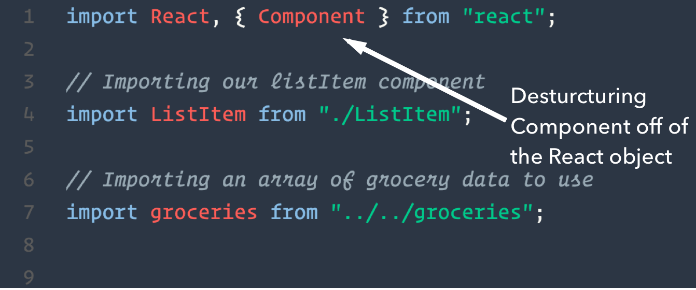

* Briefly point out the ES6 import statements where we require React, and pull the Component property off of React with ES6 destructuring. This allows us to write `extends Component` rather than `extends React.Component`.

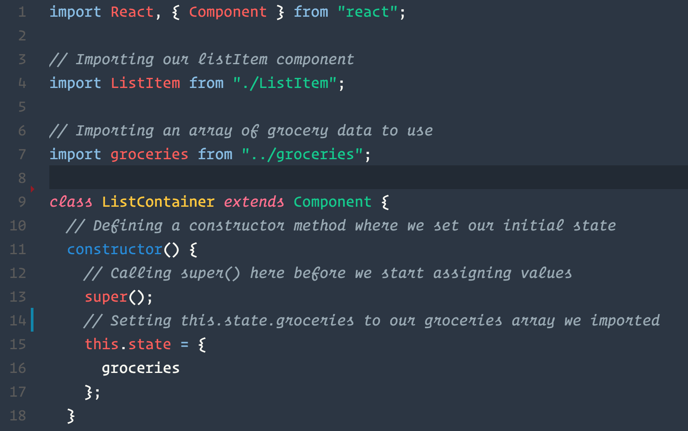

* Point out how in ES6, we can use the shorthand we're using here to set `this.state.groceries` inside the constructor. This is possible when the property name is going to be the same as a variable we're assigning it to.

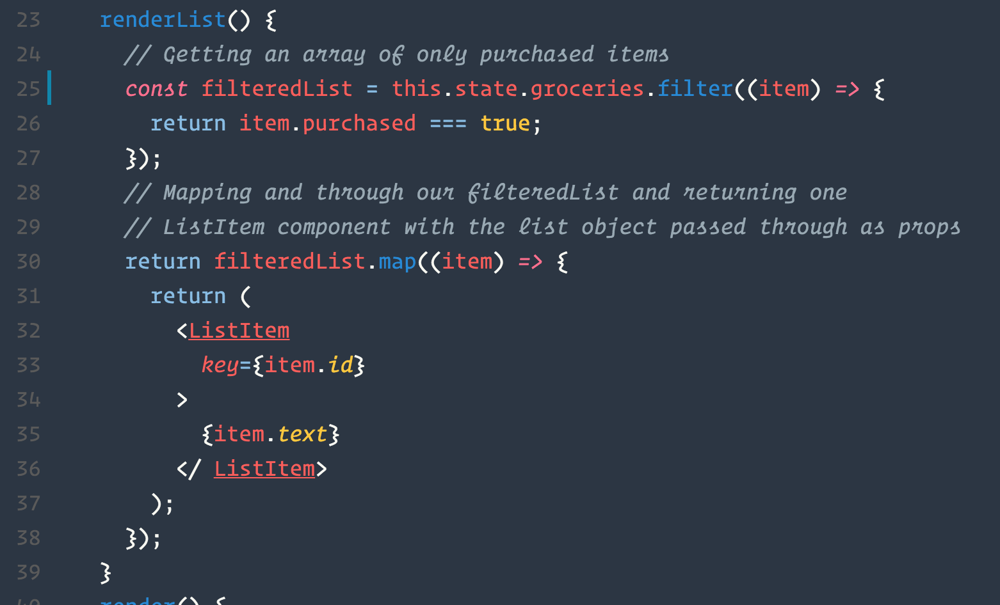

* Most importantly make sure students understand what's happening inside of our renderList method.

  * We create a brand new array by filtering `this.state.groceries` and returning only the items whose `purchased` property is set to `true`.
  
  * We then return the result of a map. Inside our map, we return one ListItem component for each grocery in our filtered list. We give each ListItem a unique key of the grocery's id, and then we pass the grocery item's text property in as a child of ListItem.

* If student's are confused about why we're passing the text through as a child, show them the ListItem component.

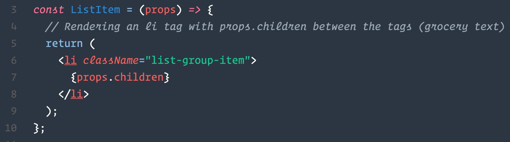

* Remind them from when we went over React Router that anything we pass inside two component tags is available inside of that component's props as "children". This is just a convenient way to pass this data here since we can treat the ListItem components here the same way we'd treat regular `li` tags in HTML.

- - -

### 4. Instructor Do: Introduce Array.prototype.concat (0:10)

* Inform students that in addition to having new array methods to loop over and filter arrays, we also have some new methods for adding new elements to arrays.

* Explain that concat, like map and filter, is an array method that is run on an existing array and returns a brand new array with some extra data added to it.

* Ask students why we might need this. Don't we have push?

  * concat can be used to combine two or more arrays.
  
  * concat will always return a brand new array. This could beneficial if we don't want to modify the original data.
  
  * In React, we **never** want to mutate state directly. This could introduce unintended bugs into our app and is considered a bad practice. Whenever we set state, we should always replace the state we're "modifying" with brand new state. That's why we shouldn't "push" new items to an array on React's state.

- - -

### 5. Partners Do: Intro to Concat Activity (0:10)

* Slack out the following file and instructions:

  * File: [concatUnsolved.js](Activities/02-Concat-Intro/Unsolved/concatUnsolved.js)
  
  * Instructions: 
  
    * 1. Run the concat method on the appointments array to create a new array by adding on two additional times of your choice and console.log the result
    * 2. Using the concat method, create a brand new array that combines candies and chocolates. console log the result
    * 3. Using the concat method, reassign the value of the oneThroughTen array to have the remaining numbers (5-10) added on. Make sure to save this completed array in the same oneThroughTen variable. console log the updated array
  
  * **Hint**: If you get stuck, check out the mozilla docs: <https://developer.mozilla.org/en-US/docs/Web/JavaScript/Reference/Global_Objects/Array/concat>

- - -

### 6. Everyone Do: Review Intro to Concat Activity (0:10)

* As a class, go over the concat solution. 

* Have students explain to you what each piece of code is doing.

* Make sure they understand the third problem in particular. Ask them why we used let instead of const for that example.

  * const can be **modified** when it's a non-primitive type. But const can never be completely reassigned.

- - -

### 7. Partners Do: React State Concat Activity (0:15)

* Slack out the following folder and instructions:

  * Folder: [03-React-State-Concat/Unsolved](Activities/03-React-State-Concat/Unsolved)
  
  * Instructions: 
      
    * The goal of this exercise is to fill in missing functionality for this application. Currently, we're unable to add new comments.  
    
    * Unzip the folder slacked out to you, run `npm install`, and start the app.
    
    * Navigate to the `ListContainer.js` component and scroll down to the `addComment` method.
    
    * This method is called whenever the app's submit button is pressed. It is passed the text typed inside of the text area. 
    
    * Inside this method, create an object to hold a new comment. This object should have a text property for the actual comment text and a (preferably unique) id.
    
    * Once the object is created, append it to this.state.comments using the concat method.
    
    * Hint: A global `currentId` variable is made available. Use this value to determine the id to be used for each comment

- - -

### 8. Everyone Do: Review React State Concat Activity (0:15)

* As a class go through the React State Concat activity.

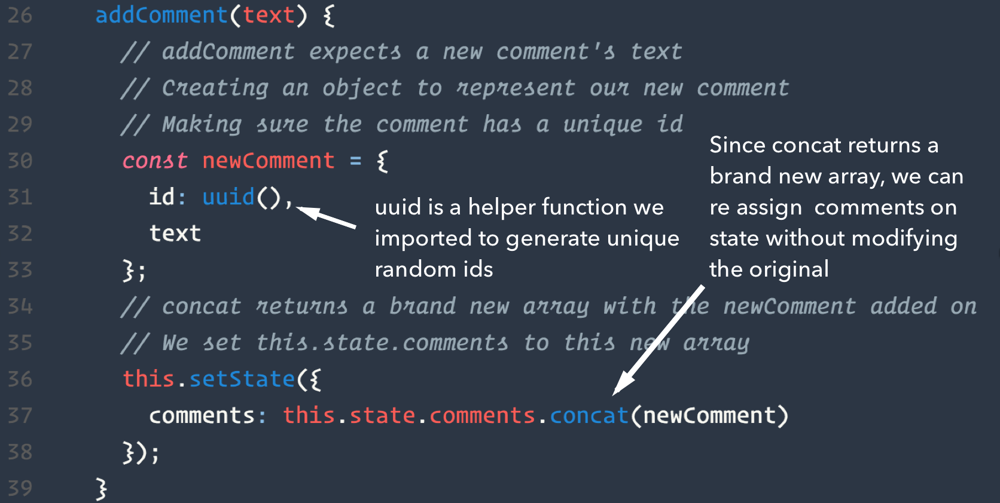

* Focus here how we first construct an object we want to add to our comments array, and use `concat`, rather than `push` to update comments. This might seem trivial to some, but stress that never mutating state is an important pattern to adhere to in React.

* Point out the currentId variable and then section of code where we create a new comment:

```js
const newComment = {
      id: ++currentId,
      text
    };
```

* By always setting the `id` equal to the incremented `currentId`, we get a unique `id` property for each comment. Explain to students that we should try to always have a unique "key" prop to pass any components we're returning in a map, especially when dealing with dynamic data.

* For previous exercises didn't have to worry about generating ids because we weren't creating new objects to add to our state array, and we were already provided with ids with existing data.

* The unique key prop can be **anything** as long as it's unique. It can even be the text of the comment if we know for sure that won't ever be duplicated. But it should always be something unique and specific to that piece of data. This could have also been a counter variable we defined outside of the component, used, and incremented when needed.

  * The index of the map is not specific to any individual piece of data in a mapped array because an item's index may change as the array changes. 

  * Webpack will still compile our code if we don't have a unique key prop, but we'll get a warning in our console and possibly take a performance hit. We may even experience unexpected bugs as our mapped data changes.

  * If our data came from a database, we could use the id given to that record from the database.

* Spend any extra time here going over the renderList method or answering any questions students might have about other parts of the code.

- - -

### 9. BREAK (0:15)

- - -

### 10. Instructor Do: Demonstrate Conditional Rendering App (0:05)

* Open and run the [`Solved`](Activities/04-Conditional-Rendering/Solved) version of the 04-Conditional-Rendering application.

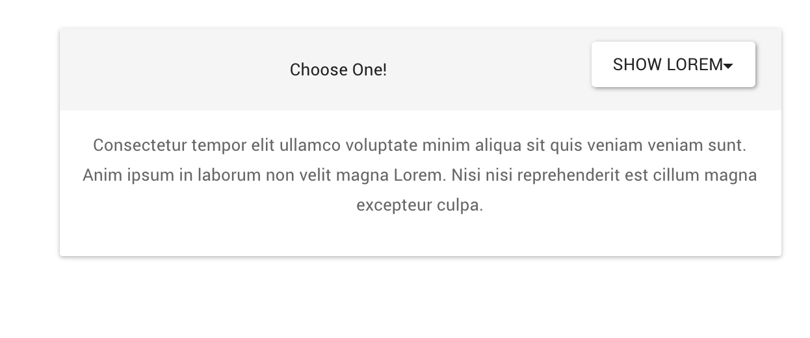

* Be sure to demonstrate the application's simple functionality.

  * As you toggle the dropdown, different data is rendered inside the panel body.

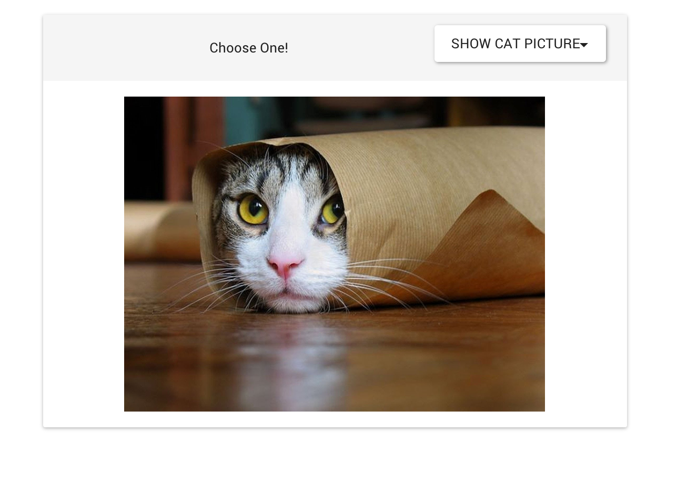

* There are a few different ways to conditionally render components or JSX. For the next exercise, students will investigate a few different methods and choose one to implement in an incomplete version of this app.

- - -

### 11. Partners Do: React Conditional Rendering Activity (0:15)

* Slack out the following folder and instructions:
    
  * Folder: [`Unsolved`](Activities/04-Conditional-Rendering/Unsolved)
  
  * Instructions:
      
    * Unzip and open the folder that was slacked out. Run `npm install`.
    
    * Navigate to the `Panel.js` file. Here we want to write some logic in order to render the following inside the `panel-body` div inside of the render method:
        
      * When `this.state.selected.value` is equal to "SHOW_LOREM", render a paragraph of lorem ipsum (or any text of your choice).
      
      * When `this.state.selected.value` is equal to "SHOW_CAT" render an image of a cat (anything you can find online).
      
      * When `this.state.selected.value` is equal to "SHOW_NOTHING", make sure nothing is rendered inside the panel-body div.
      
      * **Important**: `this.state.selected` changes whenever the dropdown is changed. 
    
    * There are multiple ways to accomplish this, take a minute to checkout Facebook's docs on conditional rendering in React: <https://facebook.github.io/react/docs/conditional-rendering.html>

- - -

### 12. Everyone Do: Review React Conditional Rendering Activity (0:10)

* Go over the code inside the [`Solved`](Activities/04-Conditional-Rendering/Solved) folder.

* Explain that in this solution we created a method that handled all of our rendering logic for us:

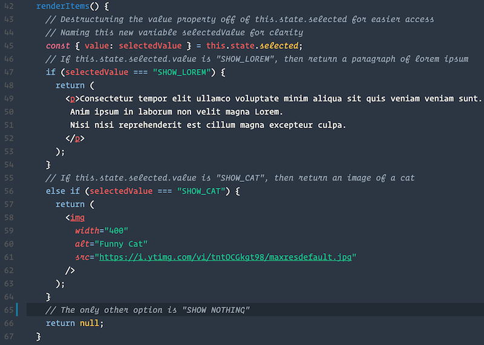

* This method returns some different content depending on what the selected checkbox value is. Inside our render method, we simply call this method inside of curly braces.

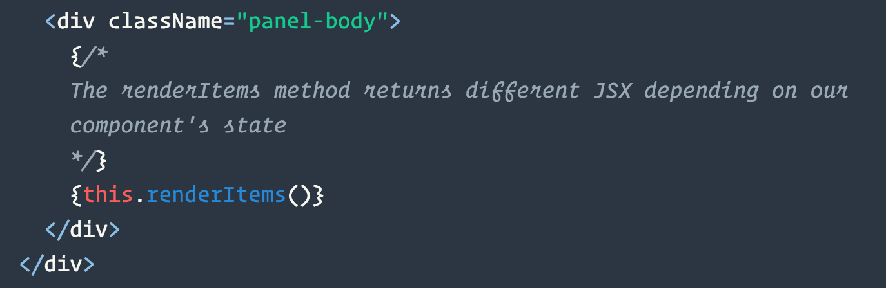

* Another, albeit less practical option for this situation would have been to do all our conditional logic within curly braces inside our JSX returned by our render method. This may be suitable if we don't have much logic to write. An `if` statement wouldn't work in that case, we need an expression that returns a value inside JSX curly braces. So as described in the React docs, we could use a ternary operator or a short circuit evaluation instead.
    
  * <https://developer.mozilla.org/en-US/docs/Web/JavaScript/Reference/Operators/Logical_Operators#Short-circuit_evaluation>
  
  * <https://developer.mozilla.org/en-US/docs/Web/JavaScript/Reference/Operators/Conditional_Operator>

* For now, students should be fine just understanding that we can conditionally return some JSX inside of a helper method.

- - -

### 13. Instructor Do: Introduce React Quotes App (0:05)

* Open and run the Quotes App [`Solved`](Activities/05-Quotes-App/Solved) in your browser.

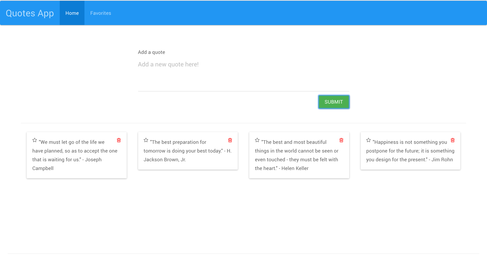

* This application allows us to create and save quotes which are saved to a mongo database. We can from there toggle a quotes "favorite" status by click on the star, or delete a quote entirely by click on the trashcan icon.

* Inform students that for this activity they don't need to worry about the backend at all. The application skeleton we'll provide has a backend already built for them complete with routes, a mongoose schema and logic for creating, reading, updating, and deleting quotes. The only thing they need to worry about building a React app to interface with this backend and display this information to the user.

* Inside the unsolved folder we'll slack out there will be an `API.js` helper file for communicating with the database made for them already. This will have comments describing each helper method.

* As a stretch goal, students should try and create a second react route where only favorited quotes are displayed.

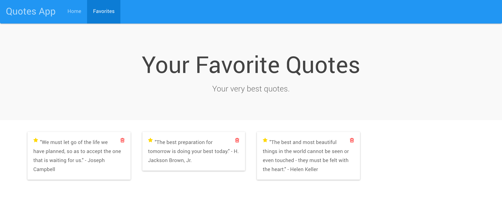

* Students should work in groups for this assignment. They should concentrate on getting the core functionality working first and avoid getting stuck on CSS. Use bootstrap classes.

* This activity should allow students to practice some of the new skills they've acquired over the past few days.

* Instructors/TAs: Make sure you're walking around during this activity answering any questions for students and providing guidance so that they may complete as much of this activity as possible.

- - -

### 14. Groups Do: React Quotes App (0:40)

* Slack out the following folder and instructions:

  * Folder: [`Unsolved`](Activities/05-Quotes-App/Unsolved)
  
  * Instructions:
      
    * Unzip and open the folder slacked out to you. Run `npm install` to install any dependencies.
    
    * Run the following in separate terminal tabs:
      * `mongod`
      * `webpack -w`
      * `node server`
        
    * Navigate localhost:3000. If done correctly you should see the text "Hello World".
    
    * Take a moment to study the Quote schema in the `quote.js` file. 
    
    * Take a moment to study the `API.js` file inside the `app/utils/` folder. This file contains methods needed to interact with the quotes collection in the database. There is no need to modify this file or any files on the server.
    
    * This project already includes a bootstrap CDN. With your group, build out the various components you will need in order to have a functioning application. Don't spend much time worrying about perfecting CSS, save time using built-in bootstrap classes.
    
    * As a stretch goal, add another route inside React router which will render favorited quotes only.
    
    * **Hint**: Some components you will need include:
        
      * A component to display each quote retrieved from the database. e.g. bootstrap panels.
      
      * A component for an input for writing/submitting a new quote to the database.
      
      * A navbar component.
      
      * A footer component.

- - -

### 15. Instructor Do: Dismiss Class (0:00)

* Slack out the [`Solved`](Activities/05-Quotes-App/Solved) version of the previous exercise.

* Dismiss class.

- - -

### 16. END
- - -

### Copyright
Coding Boot Camp (C) 2016. All Rights Reserved.
